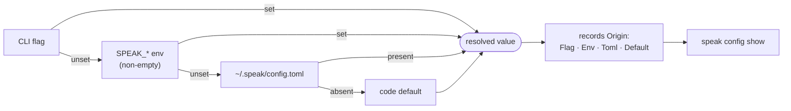
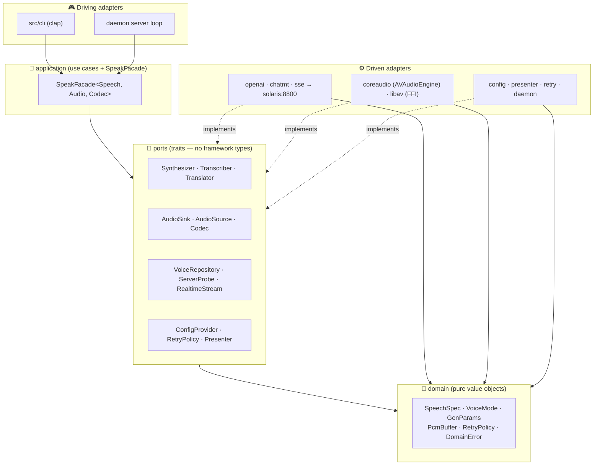
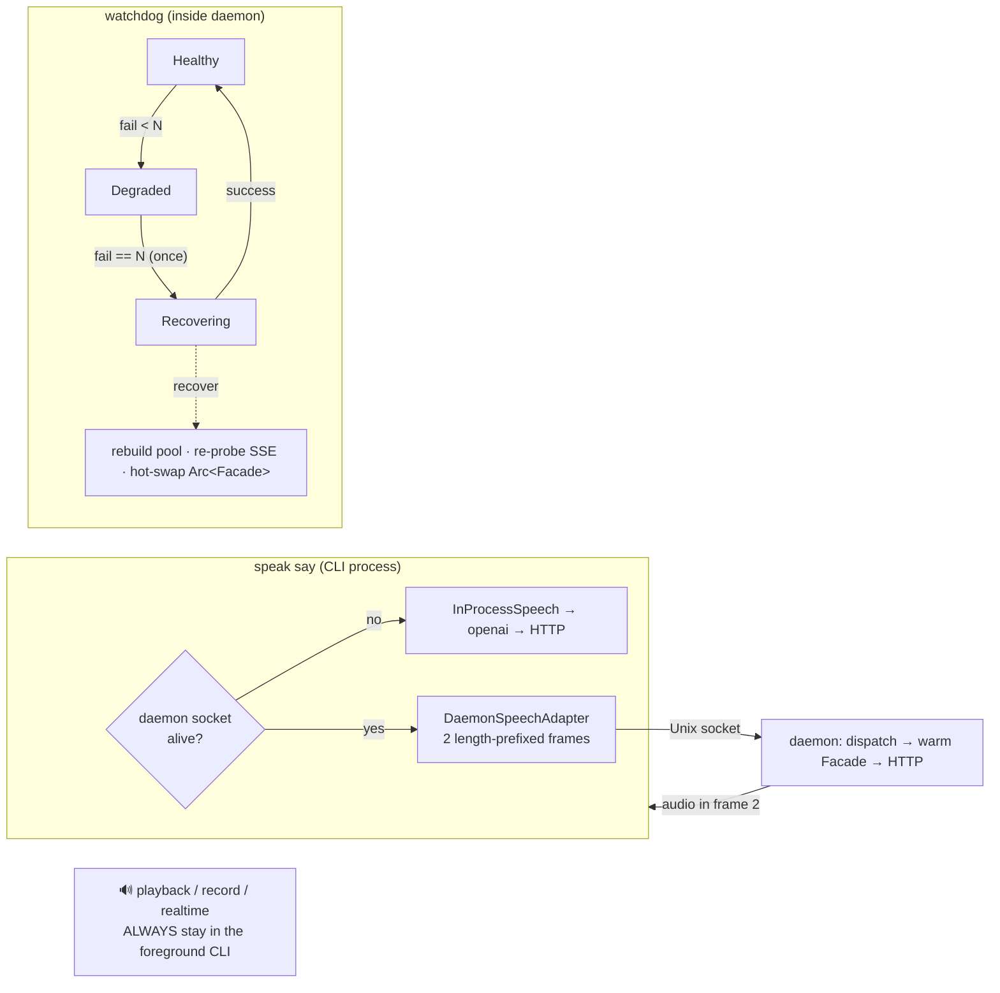
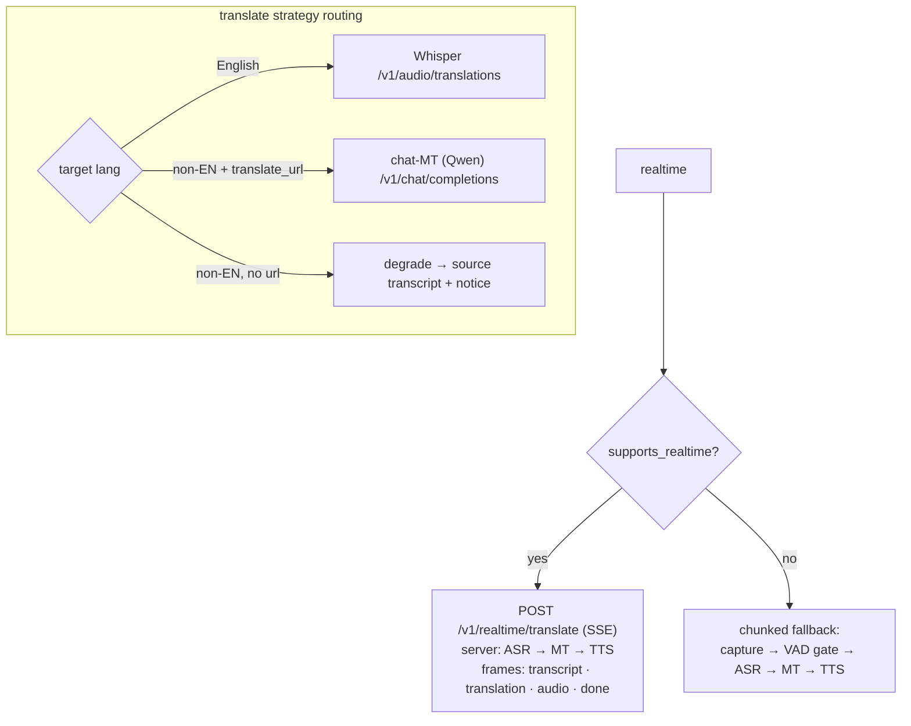

<p align="center">
  
</p>

<p align="center">
  
  
  
  
  
  
</p>

> **`speak`** is a single-binary, **OpenAI-compatible speech CLI** for the [OmniVoice](#-what-is-omnivoice) server.
> It does **TTS** (with 23-tag voice design + voice cloning), **Whisper STT**, **Qwen machine translation**,
> and **live SSE translation** — playing and recording audio through native **CoreAudio** and **ffmpeg-FFI**
> with **zero subprocess calls**, optionally fronted by a warm persistent **daemon**. 🎙️

---

## 📚 Table of contents

- [✨ Features](#-features)
- [🧭 What is OmniVoice](#-what-is-omnivoice)
- [💻 Requirements & platform support](#-requirements--platform-support)
- [🛠️ Install & build](#️-install--build)
- [⚡ Quickstart](#-quickstart)
- [🎛️ Commands & usage](#️-commands--usage)
- [⚙️ Configuration](#️-configuration)
- [🏗️ How it works (architecture)](#️-how-it-works-architecture)
- [🧪 Troubleshooting](#-troubleshooting)
- [👩‍💻 Development](#-development)
- [🗂️ Project layout](#️-project-layout)
- [📐 Architecture decisions (ADRs)](#-architecture-decisions-adrs)
- [📄 License](#-license)

---

## ✨ Features

| | Capability | Notes |
|---|---|---|
| 🗣️ | **Text-to-speech** | `say` → synthesize and play, or save to `mp3/opus/aac/flac/wav/pcm` |
| 🎭 | **Voice design** | `--instruct` with **23 canonical tags** (gender · age · pitch · accent) — free text is rejected |
| 🧬 | **Voice cloning** | register a reference clip, then synthesize in that voice (`voices add` → `--voice`) |
| ✍️ | **Speech-to-text** | `transcribe` via Whisper (`text/json/srt/vtt/verbose_json`) |
| 🌍 | **Translation** | `translate` → English (Whisper) or **any** language (Qwen chat-MT) |
| 📡 | **Realtime** | live mic → translate → speak loop over **SSE**, with a chunked fallback |
| 🔊 | **Multi-output fan-out** | one decode → **N** output devices simultaneously (`--output-device` repeatable) |
| 🧰 | **Persistent daemon** | warm pooled connection over a Unix socket + self-healing health watchdog |
| 🎚️ | **Native audio** | CoreAudio `AVAudioEngine` mixer + mic capture; libav decode via in-memory FFI |
| 🧱 | **Layered config** | `flag > env > toml > default`, and `config show` tells you *where each value came from* |
| 🛡️ | **Resilient I/O** | exponential backoff + jitter retry, transparently decorating every network port |
| 📤 | **Presenter output** | console or `--json`; results to stdout, diagnostics to rotating logs + stderr |

---

## 🧭 What is OmniVoice

`speak` is a **client** — it talks to a separate server and ships no models of its own.

The companion **OmniVoice** server is an OpenAI-compatible FastAPI service (GPU-backed, e.g. an RTX 4090)
that exposes TTS + faster-whisper ASR + Qwen MT. By default `speak` targets `http://solaris:8800`.
There is **no public/hosted instance** — you point `speak` at your own deployment via `--host` /
`SPEAK_HOST`. The endpoints it expects:

| Endpoint | Used by |
|---|---|
| `GET /health`, `GET /v1/models` | `check` / `health` / capability probe |
| `POST /v1/audio/speech` (+`instruct`, clone, gen-params, seed) · `POST /tts` | `say` |
| `POST /v1/audio/transcriptions` | `transcribe`, `translate --format srt/vtt` |
| `POST /v1/audio/translations` | `translate` (English) |
| `POST /v1/chat/completions` (Qwen MT) | `translate` (non-English) |
| `GET/POST/DELETE /voices` | `voices` CRUD |
| `POST /v1/realtime/translate` (**SSE**) | `realtime` |

---

## 💻 Requirements & platform support

| Need | Detail |
|------|--------|
| 🦀 **Rust 1.95** | pinned in `rust-toolchain.toml`; edition 2024, resolver 3 |
| 🎬 **ffmpeg 8.1 + libav\* dev** | `brew install ffmpeg` → `libavcodec 62` for the `ffmpeg-the-third` FFI |
| 🔧 **libclang** (bindgen) | `brew install llvm` → `/opt/homebrew/opt/llvm/lib` |
| 🍎 **macOS arm64** | native CoreAudio via `objc2-avf-audio` |
| 🛰️ **OmniVoice server** | reachable; default `http://solaris:8800` |

> [!IMPORTANT]
> **Native audio (playback, mic capture, device routing) is macOS arm64 only.** On other platforms the
> crate still compiles, but the audio ports return a clear error — so **file-oriented commands**
> (`transcribe`, `translate`, `say -o file`) work cross-platform, while live playback/record/realtime do not.

---

## 🛠️ Install & build

The **Makefile is the canonical entry point** — it exports the FFI build env (`PKG_CONFIG_PATH`,
`LIBCLANG_PATH`) for every recipe, which raw `cargo` does not.

```bash
brew install ffmpeg llvm          # libav* + libclang

make build-release                # → target/release/speak (LTO + strip)
make install                      # build-release + Apple codesign + symlink bin/speak
```

`make install` produces `bin/speak` (a symlink to the release binary) and, on macOS,
**Apple-codesigns** the Mach-O. See [Development → packaging & signing](#-development).

<details>
<summary>Raw <code>cargo</code> (without make)</summary>

```bash
export PKG_CONFIG_PATH=/opt/homebrew/lib/pkgconfig:$PKG_CONFIG_PATH
export LIBCLANG_PATH=/opt/homebrew/opt/llvm/lib
cargo build --release
```
</details>

---

## ⚡ Quickstart

Your first 60 seconds:

```bash
export SPEAK_HOST=http://solaris:8800     # point at your OmniVoice server

speak check                               # OS + hw-accel probe + log path (offline)
speak health                              # pretty-print the server's /health

speak say "Olá, mundo!"                   # synthesize (pt-BR) and play natively 🔊
echo "via stdin" | speak say              # stdin fallback
```

If nothing plays, jump to [Troubleshooting](#-troubleshooting).

---

## 🎛️ Commands & usage

```bash
speak say "Olá mundo"                                   # TTS → native playback
speak say --no-play -o out.mp3 "hi"                    # save without playing
speak tts "olá" --speed 1.1                            # `tts` is an alias of `say`

# 🎭 voice design (canonical tags) + pass-through generation params
speak say --instruct "Female, Young Adult, British Accent" --set num_step=32 "hello"
speak say --list-designs                               # list the 23 valid tags (offline)

# 🧬 saved voices (cloning)
speak voices add myvoice --audio ref.wav --ref-text "reference transcript"
speak voices list                                      # | rm <name>
speak say --voice myvoice "fala com a minha voz"       # clone mode

# ✍️ STT / 🌍 translation
speak transcribe audio.mp3                             # → transcript text
speak transcribe a.mp3 --format json                  # extract .text from JSON
speak translate foreign.mp3                            # → English (Whisper)
speak translate foreign.mp3 --to fr                    # → French (Qwen chat-MT)
speak translate clip.mp3 --format srt                  # → SOURCE-language subtitles ⚠️

# 📡 realtime + 🔊 multi-output
speak realtime --from en --to pt-BR                    # live mic translation; Ctrl-C to stop
speak realtime -d 182 --no-vad --echo                 # pick mic device 182, gate off, echo test
speak realtime -d 143 -I 0                            # multichannel interface (SSL 12): capture input 1 only
speak realtime --vad-floor -50                        # loosen the silence gate (dBFS) for noisy input
speak say "broadcast" -D 41 -D 73                     # fan-out to 2 output devices (-D = --output-device)

# 🧰 daemon + ⚙️ ops
speak daemon | daemon status | daemon stop | daemon restart
speak devices [--json]                                 # list in/out devices + IDs
speak record -o clip.wav --duration 5 --format wav|flac
speak config init | path | show                        # `show` prints value + origin
speak completions zsh|bash|fish|powershell             # shell completion script
speak check | health | --version
```

**Global flags (every command):** `-H/--host` · `-K/--api-key` · `-L/--lang` ·
`-C/--voice` · `-J/--json` · `-q/--quiet` · `-v/--verbose`.

> 💡 **Every option has a short flag** (`speak say -i "Female, British Accent" -s 1.1 -o out.mp3`).
> `--voice` is `-C` because `-v`/`-V` are taken by verbose/version. Run `speak <cmd> --help` for each
> command's map. Capture device selection: `record -D <id>` / `realtime -d <id>` pin a specific
> input `AudioDeviceID` (see `speak devices`); `-I <n>` / `[audio.input].channel` selects one input
> channel of a multichannel interface (e.g. SSL 12); `realtime --no-vad` / `--vad-floor <dBFS>` tune
> the silence gate.

### 🎭 The 23 voice-design tags

`--instruct` accepts a comma-separated list drawn **only** from this vocabulary (case-insensitive,
order preserved on the wire). A single unknown tag fails the whole request — no free text.

| Group | Tags |
|---|---|
| 👤 **Identity / age** | `male` · `female` · `child` · `teenager` · `young adult` · `middle-aged` · `elderly` |
| 🎚️ **Pitch / timbre** | `very low pitch` · `low pitch` · `moderate pitch` · `high pitch` · `very high pitch` · `whisper` |
| 🌐 **Accent** | `american` · `australian` · `british` · `canadian` · `chinese` · `indian` · `japanese` · `korean` · `portuguese` · `russian` accent |

> [!NOTE]
> `translate --format srt|vtt` produces **source-language** cues (it routes through the transcription
> endpoint). Translated subtitles are a future enhancement.

---

## ⚙️ Configuration

**Precedence (highest wins):** `CLI flag` → `SPEAK_* env` → `~/.speak/config.toml` → built-in default.
Every tunable has a `SPEAK_*` override and a code default — there are no magic numbers.



`speak config init` writes a fully-commented file; `speak config show` prints **each value and its origin**.
A representative excerpt of `~/.speak/config.toml`:

```toml
[server]
host = "http://solaris:8800"
# api_key = "sk-..."          # bearer token; sent only when set (masked as *** in `config show`)
# http2 = false               # prefer HTTP/2 prior knowledge

[tts]
language = "pt-BR"
voice    = "alloy"            # saved voice name for cloning
format   = "mp3"             # mp3 | opus | aac | flac | wav | pcm
# instruct = "Female, British Accent"
# native   = false            # use the server's native /tts endpoint

[tts.gen]                     # all unset => server default
# num_step = 32               # `steps` is an accepted alias; `num_steps` is rejected

[audio.input]
chunk_secs           = 5.0
silence_threshold_db = -38.0  # VAD silence gate (dBFS)
vad                  = true

[daemon]
idle_timeout = 0              # auto-stop after N idle seconds (0 = never)
autostart    = false         # spawn a background daemon for one-shot CLI calls

[http]
# translate_url   = "http://solaris:8800/v1/chat/completions"   # enables non-English MT
# translate_model = "gpt-4o-mini"

[retry]
# max_retries = 3             # equal-jitter exponential backoff, 200ms base, 5s ceiling, 2x
# retry_on = ["connect", "timeout", "5xx", "429"]
```

**Key env vars:** `SPEAK_HOST`, `SPEAK_API_KEY`, `SPEAK_LANG`, `SPEAK_VOICE`, `SPEAK_FORMAT`,
`SPEAK_HWACCEL`, `SPEAK_LOG`/`SPEAK_LOG_DIR`, `SPEAK_RETRY_*`, `SPEAK_TRANSLATE_URL`,
`SPEAK_DAEMON_HEALTH_INTERVAL`, `SPEAK_CONFIG`.

---

## 🏗️ How it works (architecture)

`speak` is **Hexagonal (Ports & Adapters) + DDD + GoF**. Dependencies point **inward**
(`adapters → application → domain`); framework crates live **only** in the adapters layer.
The one rule: *no framework type ever crosses a port* (the lone documented exception is
`ConfigProvider`, which carries the plain-data `Config`).

### 1️⃣ The hexagon — where everything lives



### 2️⃣ End-to-end lifecycle of `speak say`

The single most clarifying picture: config load → factory → speech-role decision → port → adapter →
server → decode → native playback → presenter.


### 3️⃣ Daemon vs one-shot — transparent forwarding + self-healing

Running [`speak daemon`](#️-commands--usage) holds **one warm pooled connection** on a Unix socket;
every other invocation forwards to it through two length-prefixed frames (JSON header + binary audio),
falling back to in-process when absent. **Both paths share the same five ports**, so use cases never know
the difference. Crucially, **audio capture and playback always stay in the foreground CLI — record,
realtime, and playback are never forwarded.** A background watchdog probes `/health` and hot-swaps the
connection pool on recovery.



### 4️⃣ Realtime pipeline & translator strategy

`realtime` probes `supports_realtime()` at runtime to choose the **SSE** path (server does ASR→MT→TTS)
or a chunked fallback. `translate` is a **Strategy** routed by target language.



### 🧩 Cross-cutting threads

- 🚫 **Zero-subprocess invariant.** All media is in-process: libav linked via FFI (decode through a
  custom in-memory AVIO callback; FLAC mux through an in-memory write+seek sink), CoreAudio native.
  Never `ffmpeg`/`afplay`/`ffplay`. This is **enforced in CI** by `tests/gates.rs::zero_media_exec`.
- 🛡️ **Resilience.** `classify(err)` → `ErrorKind` → `should_retry` → equal-jitter backoff →
  `tokio::sleep`, wrapped as a **port-preserving `Retry<Inner>` decorator** so use cases stay oblivious.
  SSE uses a `ReconnectingStream` whose retry budget resets on each successful frame. Jitter is
  deterministic under a seed for reproducible tests.
- 🎭 **Voice-mode wire exclusivity.** `Design → instruct` only · `Clone → voice + ref_text` ·
  `Standard → voice` only — mutually exclusive on the wire.
- 🔊 **Multi-output fan-out (ADR-0007).** One decode → N `AVAudioEngine` instances, each pinned to a
  device; the raw `AudioDeviceID` never crosses the `AudioSink` port.

---

## 🧪 Troubleshooting

| Symptom | Cause & fix |
|---|---|
| 🔇 no audio plays | macOS only — non-mac builds return an audio-port error. Use `speak devices` to confirm output. |
| 🎤 `record`/`realtime` errors instantly | macOS **microphone permission** denied — grant it in System Settings → Privacy. |
| 🤫 `realtime` captures but does nothing | Wrong input device or the silence gate eats every chunk. Pick the mic with `realtime -d <id>` (`speak devices`), and/or loosen it with `--vad-floor -50` or disable via `--no-vad`. Verify signal: `speak record -D <id> -d 3 -o /tmp/t.wav` then check the level. |
| 🎛️ multichannel interface (SSL/Focusrite) is silent | The mic is on one input of a many-channel device; the mono downmix averages all of them and dilutes it. Capture just that input: `realtime -d <id> -I <channel>` / `record -D <id> -I <channel>` (0-based), or set `[audio.input].channel` once. |
| 🔌 `health` fails / calls hang | Server unreachable. Check `SPEAK_HOST`; retries back off automatically (`SPEAK_RETRY_*`). |
| 🧱 build fails on `bindgen`/`pkg-config` | Missing FFI env — use `make` (auto-exports), or set `LIBCLANG_PATH` + `PKG_CONFIG_PATH`. |
| 🌍 `--to fr` returns English/transcript | Non-English MT needs `[http].translate_url` (`SPEAK_TRANSLATE_URL`) set. |
| 🧟 stale daemon socket | `speak daemon restart` (single-instance: SIGTERM → grace → SIGKILL takeover). |
| 🔍 want runtime truth | `speak -v ...` (rotating logs in `~/.speak/logs`) or the headless lldb targets (`make debug-*`). |

---

## 👩‍💻 Development

The Makefile groups every workflow — `make help` lists them all.

| Task | Command |
|------|---------|
| 🏗️ Build / install | `make build` · `make build-release` · `make install` (build + codesign + symlink) |
| 🔏 Codesign | `make sign` (Apple-codesign the release binary — macOS only) |
| 🧹 Lint | `make lint` (clippy + fmt-check) · `make clippy-fix` · `make fmt-fix` |
| 🧪 Test | `make test` (hermetic) · `make test-int` (live vs `$SPEAK_HOST`, skips if down) |
| 📐 Spec gates | `make spec` (speckit validate/verify/analyze) |
| ✅ **Pre-commit bar** | `make gates` (build-release + clippy + fmt + test + spec) — green before any commit |
| 📦 Release | `make release` → Apple-signs the darwin binary, then `dist/speak-<ver>-<target>.tar.gz` + `.sha256` |
| 🐞 Debug | `make debug-bt` · `make debug-panic` · `make debug-attach` (headless lldb) |

### 🔏 Packaging & signing

`make install` and `make release` **Apple-codesign** the Mach-O on macOS (no-op off-mac, so CI never breaks).
The default identity is auto-detected from the keychain, with an ad-hoc (`-`) fallback. For a notarization-ready
distribution build:

```bash
make install \
  CODESIGN_IDENTITY="Developer ID Application: Name (TEAMID)" \
  CODESIGN_OPTS="--options runtime --timestamp"
```

### 📐 Spec-first

This is a **spec-first** project: every change starts from a spec + an MADR ADR, and docs are committed
alongside code. The functional contract lives in `docs/arch/sdd/001-.../spec.md`; structural decisions
live as ADRs (below). `make spec` must exit 0.

### 🧰 Quality bar

- Edition 2024 / resolver 3 / Rust 1.95, async on **Tokio**.
- Lint baseline: `all` group **deny**; `pedantic`/`nursery`/`cargo` **warn** (config in `Cargo.toml [lints]`).
- Tests are **hermetic** by default; the `integration` feature gates the live-server suite (TCP-probes first,
  skips when the server is down). Two hygiene gates enforce **zero-media-exec** and **zero-magic-numbers**.

---

## 🗂️ Project layout

```
src/
├── domain/        💎 pure value objects, zero IO
│                     Voice · VoiceDesign[23] · SpeechSpec · GenParams · PcmBuffer
│                     Language · AudioFormat · RealtimeMode · RetryPolicy · DomainError
├── ports/         🔌 trait interfaces (the hexagon boundary)
│                     Synthesizer · Transcriber · Translator · AudioSink/Source
│                     Codec · ConfigProvider · VoiceRepository · RealtimeStream
│                     ServerProbe · RetryPolicy · Presenter
├── application/   🧠 use cases + SpeakFacade (say/transcribe/translate/realtime/record/voices/check)
├── adapters/      ⚙️ openai · chatmt · sse · coreaudio · libav · config
│                     presenter · retry · daemon · inproc · headless · http
├── cli/           🎮 clap driving adapter (no business logic)
└── main.rs        🏭 composition root (Factory/DI); dispatch() routes commands

docs/arch/         📐 ADRs · SDD spec/plan · CUE schemas · Gherkin features
```

---

## 📐 Architecture decisions (ADRs)

The full set lives in [`docs/arch/adr/`](docs/arch/adr/):

| ADR | Decision |
|---|---|
| [0001](docs/arch/adr/0001-speak-cli-speech-client-for-solaris-server.md) | In-process media stack — ffmpeg-the-third FFI + native CoreAudio; **no child-process exec** |
| [0002](docs/arch/adr/0002-local-hardware-acceleration-and-rotating-logs.md) | Local CPU hw-accel (AudioToolbox `*_at` decoders) + rotating `tracing` logs |
| [0003](docs/arch/adr/0003-hexagonal-ddd-gof-architecture.md) | Hexagonal + DDD + GoF layer contract |
| [0004](docs/arch/adr/0004-async-openai-byot-and-sse-realtime.md) | `async-openai` _byot extended speech + SSE realtime + retry topology |
| [0005](docs/arch/adr/0005-daemon-unix-socket-persistence.md) | Unix-socket daemon, two-frame protocol, transparent one-shot fallback |
| [0006](docs/arch/adr/0006-layered-config-catalog-and-precedence.md) | Layered config precedence + full `SPEAK_*` catalog |
| [0007](docs/arch/adr/0007-digital-multi-output-routing.md) | One decode → N-device audio fan-out |
| [0008](docs/arch/adr/0008-rust-edition-2021-deferral.md) | *(superseded)* edition-2024 migration |
| [0009](docs/arch/adr/0009-output-presenter-port-and-tracing-logging.md) | Presenter port (console/json) + tracing diagnostics — no raw `println` |
| [0010](docs/arch/adr/0010-daemon-single-instance-and-health-watchdog.md) | Daemon single-instance lock + health-watchdog self-recovery |

---

## 📄 License

**MIT** (declared in `Cargo.toml`). The companion OmniVoice server is specified separately.

<p align="center"><sub>Built with 🦀 Rust · Hexagonal · zero subprocesses · macOS-native audio</sub></p>
