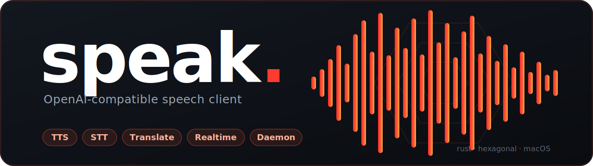
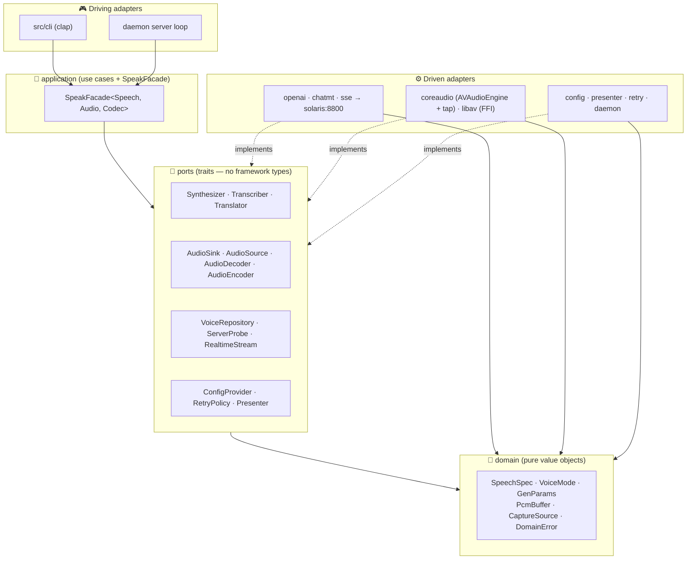
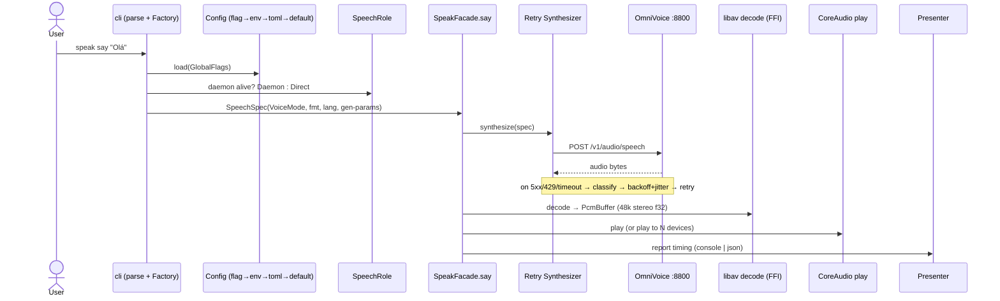
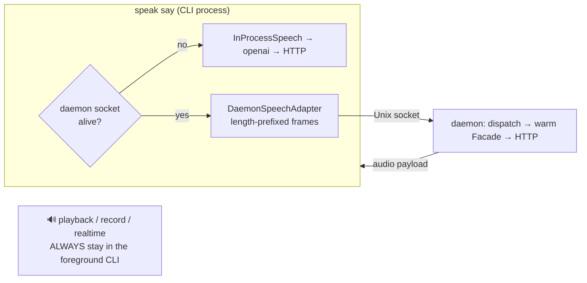
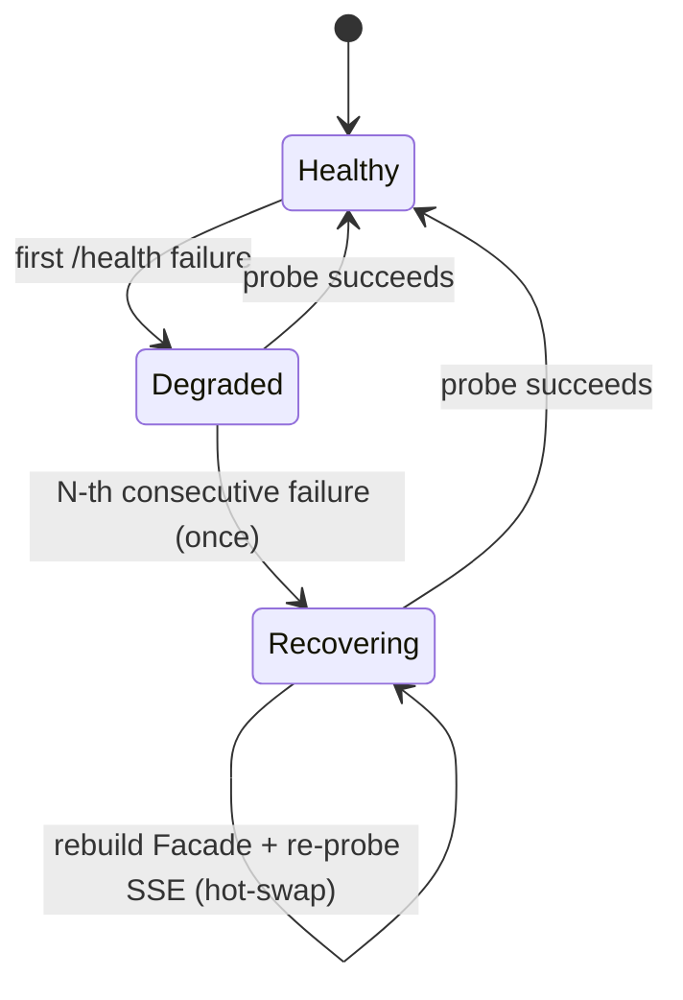
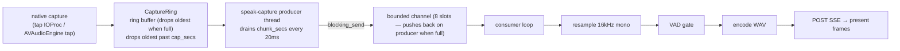
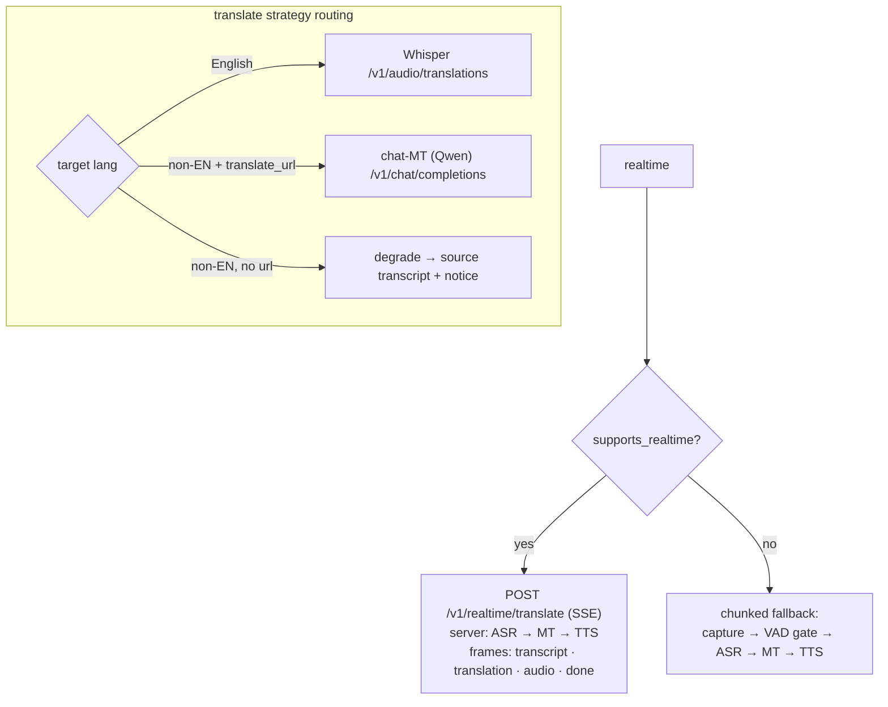

<p align="center">
  
</p>

<p align="center">
  
  
  
  
  
  
</p>

---

## 🧠 What is `speak`, in plain words

`speak` is a **single command-line program** that turns text into spoken audio, turns
audio back into text, and translates speech — all from your terminal. 🎙️

Here is the mental model that explains everything else:

> **`speak` is the remote control. [OmniVoice](#-what-is-omnivoice) is the engine room.**

The heavy lifting — the actual AI that generates voices, recognizes speech, and translates —
runs on a **separate GPU server called OmniVoice** (think: a beefy machine with an RTX 4090).
`speak` itself is small and **ships no AI models at all**. It knows how to:

1. **Record or read your audio/text** on your Mac (using native macOS audio — no helper apps).
2. **Send it over the network** to the OmniVoice server (by default `http://solaris:8800`).
3. **Receive the result** (audio bytes or text) and **play it, save it, or print it** for you.

So when you run `speak say "Hello"`, the words travel to the engine room, come back as an
MP3-shaped stream of audio, and your Mac plays it through the speakers — all in one command.
If the server is unreachable, `speak` tells you clearly instead of guessing.

Because it speaks the **OpenAI-compatible** dialect (the same request shapes used for
`/v1/audio/speech`, Whisper transcription, etc.), it slots in front of any compatible backend
you run yourself.

---

## 📚 Table of contents

- [🧠 What is `speak`, in plain words](#-what-is-speak-in-plain-words)
- [✨ What can it do](#-what-can-it-do)
- [🧭 What is OmniVoice](#-what-is-omnivoice)
- [💻 Requirements & platform support](#-requirements--platform-support)
- [🛠️ Install & build](#️-install--build)
- [⚡ Quickstart](#-quickstart)
- [🎛️ Commands & usage](#️-commands--usage)
- [⚙️ Configuration](#️-configuration)
- [🏗️ How it works (architecture)](#️-how-it-works-architecture)
- [🧪 Troubleshooting](#-troubleshooting)
- [👩‍💻 Development](#-development)
- [🗂️ Project layout](#️-project-layout)
- [📐 Architecture decisions (ADRs)](#-architecture-decisions-adrs)
- [📄 License](#-license)

---

## ✨ What can it do

| | Capability | What it means for you |
|---|---|---|
| 🗣️ | **Text-to-speech (TTS)** | `say` turns text into speech and plays it, or saves it to `mp3 / opus / aac / flac / wav / pcm`. |
| 🎭 | **Voice design** | `--instruct` shapes the voice from **23 canonical tags** (gender · age · pitch · accent). Free text is rejected — you pick from a fixed menu. |
| 🧬 | **Voice cloning** | Register a short reference clip once, then make the server speak in *that* voice (`voices add` → `--voice`). |
| ✍️ | **Speech-to-text (STT)** | `transcribe` a file via Whisper, or `--stream` your live mic into an incremental transcript. |
| 🌍 | **Translation** | `translate` a file or live stream → English (Whisper) or **any** language (Qwen machine translation). |
| 📡 | **Realtime translation** | `realtime` runs a live mic → translate → speak loop over **SSE** (server-sent events: the server streams results back continuously, like a news ticker, rather than all at once). |
| 🎧 | **Capture the PC output** | Transcribe or translate **what your Mac is playing** (a call, a video) via a native audio tap — not just the mic. |
| 🔊 | **Multi-output fan-out** (broadcasting) | Send one synthesis to **several output devices at once** — for example, speakers and headphones simultaneously (`-D`/`--output-device`, repeatable). |
| 🧰 | **Persistent daemon** | An optional warm background process keeps a connection ready, so repeat calls are fast (~0.4 s vs ~2.5 s). |
| 🧱 | **Layered config** | `flag > env > toml > default`, and `config show` tells you **exactly where each value came from**. |
| 🛡️ | **Resilient I/O** | Automatic retry with exponential backoff + jitter on flaky networks, fully transparent to the commands. |
| 📤 | **Clean output** | Human console or machine `--json`; results go to stdout, diagnostics to rotating logs + stderr. |

---

## 🧭 What is OmniVoice

`speak` is a **client** — it talks to a separate server and ships no models of its own.

**OmniVoice** is the companion server (the "engine room"): an OpenAI-compatible HTTP service,
GPU-backed (e.g. an RTX 4090), that exposes **TTS** (text-to-speech) + **Whisper** (OpenAI's
speech-recognition model — used for ASR, Automatic Speech Recognition) + **Qwen** (Alibaba's
language model — used for MT, Machine Translation). By default `speak` targets
`http://solaris:8800`.

> [!IMPORTANT]
> There is **no public / hosted OmniVoice instance.** You point `speak` at **your own**
> deployment via `--host` / `SPEAK_HOST`. The server is specified separately (in its own
> spec project) and is not part of this repository.

The endpoints `speak` expects on the server:

| Endpoint | Used by |
|---|---|
| `GET /health`, `GET /v1/models`, `GET /v1/realtime/translate` (probe) | `check` / `health` / capability probe |
| `POST /v1/audio/speech` (+`instruct`, clone, gen-params, seed) · `POST /tts` (legacy) | `say` |
| `POST /v1/audio/transcriptions` | `transcribe`, `translate --format srt/vtt` |
| `POST /v1/audio/translations` | `translate` (English) |
| `POST /v1/chat/completions` (Qwen MT) | `translate` (non-English) |
| `GET / POST / DELETE /voices` | `voices` CRUD |
| `POST /v1/realtime/translate` (**SSE**) | `realtime`, `transcribe --stream`, `translate --stream` |

The SSE stream emits five frame types: `transcript` · `translation` · `audio` · `done` · `error`.

---

## 💻 Requirements & platform support

| Need | Detail |
|------|--------|
| 🦀 **Rust 1.95** | pinned in `rust-toolchain.toml` — `rustup` installs the exact version automatically. Rust edition 2024 (the language version), resolver 3 (how it finds dependencies). MSRV = Minimum Supported Rust Version: 1.95 is the oldest version that works. |
| 🎬 **ffmpeg 8.1 + libav\* dev** | `brew install ffmpeg` → `libavcodec 62` for the `ffmpeg-the-third 5.0` FFI |
| 🔧 **libclang** (for bindgen) | `brew install llvm` → `/opt/homebrew/opt/llvm/lib` |
| 🍎 **macOS arm64** | native CoreAudio via `objc2-avf-audio` (Apple Silicon) |
| 🛰️ **OmniVoice server** | reachable; default `http://solaris:8800` |

> [!IMPORTANT]
> **Native audio (playback, mic capture, device routing) is macOS arm64 only.** On other
> platforms the crate still compiles, but the audio ports return a **clear error** — so
> **file-oriented commands** (`transcribe a.mp3`, `translate a.mp3`, `say -o out.mp3`) work
> cross-platform, while **live playback / record / realtime / streaming** do not.

---

## 🛠️ Install & build

### Why the Makefile?

Building `speak` links against ffmpeg and libclang through FFI. Those libraries are only found
if two environment variables (`PKG_CONFIG_PATH` and `LIBCLANG_PATH`) point at your Homebrew
install. **The Makefile sets those for every recipe automatically — raw `cargo` does not.**
That is why the Makefile is the **canonical entry point**: `make help` lists every target.

### Step by step

0. **Install Rust** (one time):

   ```bash
   curl --proto '=https' --tlsv1.2 -sSf https://sh.rustup.rs | sh
   ```

   This installs `rustup`, the Rust toolchain manager. The correct compiler version (1.95) is
   then pinned automatically by `rust-toolchain.toml` when you first run `make`.

1. **Install the native dependencies** (one time):

   ```bash
   brew install ffmpeg llvm        # libav* + libclang
   ```

2. **Build the release binary:**

   ```bash
   make build-release              # → target/release/speak (optimized + debug symbols removed for a smaller binary)
   ```

3. **(Optional) Install it onto your PATH:**

   ```bash
   make install                    # build-release + Apple codesign + symlink bin/speak
   ```

   `make install` creates `bin/speak` (a symlink to the release binary) and, on macOS,
   **Apple-codesigns** the release binary (Mach-O) so macOS audio features work correctly. It is
   automatically skipped on non-macOS systems, so CI never breaks.
   See [Development → packaging & signing](#-packaging--signing).

   Add `bin/` to your PATH so you can run `speak` from any directory:

   ```bash
   export PATH="$PWD/bin:$PATH"    # add to ~/.zshrc to persist
   ```

   Or prefix each command with `./bin/` if you prefer not to modify PATH.

4. **Point it at your server and smoke-test:**

   ```bash
   export SPEAK_HOST=http://solaris:8800
   ./bin/speak check               # offline self-check
   ./bin/speak health              # contacts the server
   ```

<details>
<summary>Raw <code>cargo</code> fallback (only if you are not using <code>make</code>)</summary>

You must export the FFI environment yourself first — this is exactly what the Makefile does for you:

```bash
export PKG_CONFIG_PATH=/opt/homebrew/lib/pkgconfig:$PKG_CONFIG_PATH
export LIBCLANG_PATH=/opt/homebrew/opt/llvm/lib
cargo build --release
```

The `version` in `Cargo.toml` (currently `0.1.0`) drives `speak --version`.
</details>

---

## ⚡ Quickstart

Your first 60 seconds:

```bash
export SPEAK_HOST=http://solaris:8800     # 1) point at your OmniVoice server

speak check                               # 2) OS + hw-accel probe + log path (offline)
speak health                              # 3) pretty-print the server's /health

speak say "Olá, mundo!"                   # 4) default lang is pt-BR; use --lang en for English: speak say --lang en "Hello world" 🔊
echo "via stdin" | speak say              # 5) text can also come from stdin
```

If nothing plays, jump to [Troubleshooting](#-troubleshooting).

---

## 🎛️ Commands & usage

Every command shares a small set of **global flags**, and every option has a short form
([ADR-0012](docs/arch/adr/0012-exhaustive-cli-short-flags.md)). Run `speak <command> --help`
for the full per-command map.

### 🗣️ `say` — text to speech

```bash
speak say "Olá mundo"                                   # synthesize → native playback
speak say --no-play -o out.mp3 "hi"                     # save to a file without playing
speak tts "olá" --speed 1.1                             # `tts` is an alias of `say`
speak say "broadcast" -D 41 -D 73                       # fan-out to 2 output devices (-D repeatable)
```

Key flags: `-o/--out` (save) · `-n/--no-play` · `-s/--speed` · `-f/--format <mp3|opus|aac|flac|wav|pcm>`
· `-i/--instruct` (voice design) · `-r/--ref-text` · `-d/--duration` ·
`-S/--set KEY=VALUE` (generation params, repeatable) · `-D/--output-device <id>` (repeatable →
fan-out, [ADR-0007](docs/arch/adr/0007-digital-multi-output-routing.md)) · `-g/--list-designs` ·
`-N/--native` (use the legacy `/tts` endpoint).

### 🎭 Voice design — the 23 tags

`--instruct` accepts a **comma-separated list drawn only from this fixed vocabulary**
(case-insensitive, order is preserved in the request sent to the server). A single unknown tag fails the whole request —
there is **no free text**.

| Group | Tags |
|---|---|
| 👤 **Identity / age** | `male` · `female` · `child` · `teenager` · `young adult` · `middle-aged` · `elderly` |
| 🎚️ **Pitch / timbre** | `very low pitch` · `low pitch` · `moderate pitch` · `high pitch` · `very high pitch` · `whisper` |
| 🌐 **Accent** (each followed by the word *accent*) | `american` · `australian` · `british` · `canadian` · `chinese` · `indian` · `japanese` · `korean` · `portuguese` · `russian` |

```bash
speak say --instruct "Female, Young Adult, British Accent" --set num_step=32 "hello"
speak say --list-designs                                # print all 23 valid tags (offline)
```

### 🧬 Voice cloning

```bash
speak voices add myvoice --audio ref.wav --ref-text "reference transcript"
speak voices list                                       # | speak voices rm myvoice
speak say --voice myvoice "fala com a minha voz"        # synthesize in the cloned voice
```

> `--voice` is the global flag `-C` (not `-v`) because `-v`/`-V` are taken by verbose/version.

### ✍️ `transcribe` — speech to text

```bash
speak transcribe audio.mp3                              # one-shot file → transcript
speak transcribe a.mp3 --format json                   # text|json|srt|vtt|verbose_json
speak transcribe --stream                               # live mic → incremental transcript
speak transcribe --stream --source output              # transcribe what the PC is playing
```

`FILE` is **optional** — omit it when using `--stream`. Streaming uses the realtime SSE endpoint
and prints transcript frames only ([ADR-0014](docs/arch/adr/0014-streaming-transcribe-and-capture-source-selection.md)).

### 🌍 `translate` — translation

```bash
speak translate foreign.mp3                             # → English (Whisper)
speak translate foreign.mp3 --to fr                     # → French (Qwen chat-MT)
speak translate clip.mp3 --format srt                   # → subtitles (see caveat below) ⚠️
speak translate --stream --to es                        # live mic → incremental translation
speak translate --stream --source output --to fr        # translate the PC output live
```

`-t/--to` defaults to `en`. English routes through Whisper; **non-English requires
`[http].translate_url`** (`SPEAK_TRANSLATE_URL`) so it can reach the Qwen chat-MT endpoint.
Live streaming shares the decoupled capture pipeline
([ADR-0017](docs/arch/adr/0017-decoupled-streaming-capture-pipeline.md)).

> [!NOTE]
> `translate --format srt|vtt` produces **source-language** cues — it routes through the
> transcription endpoint, so the subtitle text is in the original spoken language, not the
> `--to` target. Translated subtitles are a future enhancement.

### 📡 `realtime` — live SSE translation

```bash
speak realtime --from en --to pt-BR                     # live mic translation; Ctrl-C to stop
speak realtime -d 182 --no-vad --echo                   # pin mic 182, disable VAD gate, echo mode: speak plays back exactly what the mic hears so you can verify capture is working
```

Mode group (mutually exclusive, default **Translate**): `-T/--translate` · `-n/--no-translate` ·
`-e/--echo`. Plus `-f/--from`, `-t/--to` (default `en`), `-i/--instruct`,
`-D/--output-device` (repeatable).

### 🎚️ Shared capture flags

These apply to every capture command (`transcribe --stream`, `translate --stream`, `realtime`,
`record`):

| Flag | Meaning |
|---|---|
| `-d/--device <id>` | Pin the input device by its numeric ID — find IDs with `speak devices`. Overrides the system default microphone ([ADR-0011](docs/arch/adr/0011-realtime-input-device-binding-and-vad-controls.md)). |
| `-x/--no-vad` | Disable the silence gate (capture everything). |
| `-F/--vad-floor <dBFS>` | Loosen/tighten the silence gate; accepts negatives (e.g. `-50`). |
| `-I/--input-channel <n>` | Capture **one 0-based channel** of a multichannel interface ([ADR-0013](docs/arch/adr/0013-input-channel-selection.md), e.g. an SSL 12). |
| `-c/--chunk <secs>` | Chunk size sent to the server (default 5). |
| `-s/--source input\|output` | Capture the mic (`input`) or the PC output (`output`) ([ADR-0015](docs/arch/adr/0015-capture-source-selection-and-native-output-tap.md)). |

### 🧰 Ops & utilities

Note: in `record`, `-d` is duration (seconds to record) and `-D` is the capture device ID —
one letter, two meanings.

```bash
speak devices [--json]                                  # list audio in/out devices + IDs
speak record -o clip.wav -d 8 -D <id> --format wav|flac # Required: -o (output file) and -d (duration in seconds). Caution: -d is duration, -D is the capture device ID — note the case difference.
speak daemon &                                          # the & runs it in the background — without it, the daemon occupies your terminal
speak daemon status | daemon stop | daemon restart
speak config init | path | show                         # `show` prints value + origin
speak completions zsh|bash|fish|powershell              # shell completion script
speak check | health | --version
```

> Note: `speak daemon` runs in the foreground (it occupies the terminal) unless you background
> it with `&` or set `[daemon].autostart = true`.

### 🌐 Global flags (every command)

`-H/--host` (`SPEAK_HOST`) · `-K/--api-key` · `-L/--lang` · `-C/--voice` · `-q/--quiet` ·
`-J/--json` · `-v/--verbose` (repeatable: `-v` info · `-vv` debug · `-vvv` trace).

> There is **no `--color` flag** — color is a config key only (`[general].color`).

---

## ⚙️ Configuration

**Precedence (highest wins):** `CLI flag` → `SPEAK_* env` (non-empty) → `~/.speak/config.toml`
→ built-in default. Every tunable has a `SPEAK_*` override and a code default — there are **no
magic numbers** ([ADR-0006](docs/arch/adr/0006-layered-config-catalog-and-precedence.md)).

The config file uses **TOML** format — plain `key = value` pairs grouped into `[sections]`, like
an INI file. Run `speak config init` to generate a fully-commented template at
`~/.speak/config.toml`.


`speak config init` writes a fully-commented template at `~/.speak/config.toml`;
`speak config show` prints **each value and its origin** (`flag`/`env`/`toml`/`default`), with
`api_key` masked as `***`. A representative excerpt:

```toml
[server]
host = "http://solaris:8800"
# api_key = "sk-..."          # bearer token; sent only when set (masked as *** in `config show`)
timeout = 300
# http2 = false               # prefer HTTP/2 prior knowledge

[tts]
language = "pt-BR"
voice    = "alloy"            # saved voice name for cloning
format   = "mp3"             # mp3 | opus | aac | flac | wav | pcm
speed    = 1.0
# instruct = "Female, British Accent"
# native   = false            # use the server's legacy /tts endpoint

[tts.gen]                     # 11 optional generation params; all unset => server default
# num_step = 32

[audio.input]
device               = 0
sample_rate          = 16000
channels             = 1
chunk_secs           = 5.0
silence_threshold_db = -38.0  # VAD silence gate (dBFS)
vad                  = true

[audio.capture]               # ADR-0015 — what to capture for --stream
source     = "input"         # input (mic) | output (PC output tap)
# device = <id>              # unset = capture from all inputs mixed together (system mix)
# channel = <n>              # unset = average all channels into mono (downmix); set to 0, 1, 2… to capture one channel
buffer_secs = 60.0           # ring-buffer ceiling for the streaming pipeline

[realtime]
to         = "en"
speak      = false           # NOTE: the key is `speak` (synthesize result), not `translate`
chunk_secs = 5.0

[daemon]
idle_timeout    = 0          # auto-stop after N idle seconds (0 = never)
autostart       = false      # spawn a background daemon for one-shot CLI calls
health_interval = 15         # /health probe cadence in seconds (0 disables)
health_fails    = 3          # consecutive failures before self-recovery

[http]
# translate_url   = "http://solaris:8800/v1/chat/completions"   # enables non-English MT
# translate_model = "gpt-4o-mini"

[retry]
max_retries = 3              # equal-jitter exponential backoff: 200ms base, 5s ceiling, 2x
retry_on    = ["connect", "timeout", "5xx", "429"]
```

**Key env vars:** `SPEAK_HOST`, `SPEAK_API_KEY`, `SPEAK_LANG`, `SPEAK_VOICE`, `SPEAK_FORMAT`,
`SPEAK_RETRY_MAX` / `SPEAK_RETRY_BACKOFF_MS` / `SPEAK_RETRY_ON`, `SPEAK_HEALTH_TIMEOUT`
(no `DAEMON` infix), `SPEAK_DAEMON_HEALTH_INTERVAL`, `SPEAK_AUDIO_CAPTURE_SOURCE` /
`SPEAK_AUDIO_CAPTURE_BUFFER_SECS`, `SPEAK_TRANSLATE_URL` / `SPEAK_TRANSLATE_MODEL`,
`SPEAK_LOG`, `SPEAK_CONFIG`.

---

## 🏗️ How it works (architecture)

This is the section worth reading if you are curious how the pieces fit. Don't worry about the
fancy names — here is the idea in plain words first.

### The big idea: keep the core clean, push the messy stuff to the edges

`speak` follows **Hexagonal architecture** (also called **Ports & Adapters**), combined with
**Domain-Driven Design (DDD)** and a handful of classic **Gang-of-Four (GoF)** patterns
([ADR-0003](docs/arch/adr/0003-hexagonal-ddd-gof-architecture.md)).

Think of the program as an **onion with three rings**:

- 💎 **Domain (the core):** pure facts and rules — what a "voice" or a "speech request" *is*.
  No networking, no audio libraries, nothing that touches the outside world.
- 🔌 **Ports (the boundary):** a list of *promises* written as Rust traits — "something can
  synthesize audio", "something can play sound". The core only ever talks to these promises.
- ⚙️ **Adapters (the edges):** the real implementations — the OmniVoice HTTP client, the macOS
  CoreAudio engine, the ffmpeg decoder. All the messy framework code lives **only here**.

The rule that keeps it tidy: **dependencies point inward** (`adapters → application → domain`),
and **no framework type ever crosses a port**. So you could swap the HTTP client or the audio
backend without touching the core logic. The one documented exception is `ConfigProvider`,
which carries a plain-data `Config` struct.

The **GoF patterns** in use, in plain terms:
**Adapter** (every edge implementation), **Strategy** (pick daemon-vs-direct, console-vs-json,
translate route by language), **Factory** (one place builds everything — the composition root),
**Decorator** (retry wraps a port without it noticing), **Builder** (`SpeechSpec::builder`),
**Facade** (`SpeakFacade` — one tidy entry point), and **Repository** (saved voices).

📖 Go deeper: the full layer contract is [ADR-0003](docs/arch/adr/0003-hexagonal-ddd-gof-architecture.md);
the functional spec is the SDD feature
[001 spec.md](docs/arch/sdd/001-speak-cli-speech-client-for-solaris-server/spec.md)
(+ [plan.md](docs/arch/sdd/001-speak-cli-speech-client-for-solaris-server/plan.md) ·
[tasks.md](docs/arch/sdd/001-speak-cli-speech-client-for-solaris-server/tasks.md)); the data
shapes are pinned in the CUE schemas
[config.cue](docs/arch/schemas/config.cue) and [voice.cue](docs/arch/schemas/voice.cue).

### 1️⃣ The hexagon — where everything lives



### 2️⃣ End-to-end lifecycle of `speak say`

The most clarifying picture: config load → factory → speech-role decision → port → adapter →
server → decode → native playback → presenter.



### 3️⃣ Daemon vs one-shot — transparent forwarding + self-healing

Running [`speak daemon`](#-ops--utilities) holds **one warm pooled connection** on a Unix
socket (`~/.speak/speak.sock`). Every other invocation forwards to it through **length-prefixed
framing** (a JSON header + a binary audio payload — *not* a raw HTTP proxy), and falls back to
running in-process when no daemon answers. **Both paths share the same ports**, so the use cases
never know the difference — same result, the daemon path is just faster on first byte
([ADR-0005](docs/arch/adr/0005-daemon-unix-socket-persistence.md) /
[ADR-0010](docs/arch/adr/0010-daemon-single-instance-and-health-watchdog.md)).

Crucially, **local audio is never forwarded**: `say` synthesizes on the daemon and the CLI plays
the bytes locally, while `record` / `realtime` capture always stay in the foreground CLI process.

> [!NOTE]
> `speak daemon` runs in the **foreground** by default — background it (`speak daemon &`) or set
> `[daemon].autostart = true` so the first `speak say` spawns a detached daemon automatically.
> Warm forwarded calls run in ~0.4 s vs ~2.5 s cold. Confirm forwarding with
> `speak daemon status` (the `requests` counter rises on each call).



The daemon also watches the server's health and **heals itself**:



### 4️⃣ The streaming capture pipeline (ADR-0017)

The live commands (`transcribe --stream`, `translate --stream`, `realtime`) all share one
**decoupled producer/consumer** pipeline. The analogy: a kitchen where the **prep cook keeps
chopping** (audio capture never stalls) and hands plates to a **bounded pass-through window**;
the **line cook** (the network consumer) picks them up one at a time. If the window fills, the
prep cook keeps the freshest food and drops the oldest — so live audio never blocks
([ADR-0017](docs/arch/adr/0017-decoupled-streaming-capture-pipeline.md)).



> Ring buffer, channel: implementation names — the kitchen analogy above is the mental model.

Backpressure flows backward: a full mpsc pushes back on the producer → the ring grows → it drops
the oldest audio past `cap_secs` (`[audio.capture].buffer_secs`, default 60). `transcribe --stream`
prints only `transcript` frames; `translate --stream` prints only `translation` frames.

> [!NOTE]
> **Ctrl-C handling matters here.** One `tokio::signal::ctrl_c()` future is pinned *outside* the
> loop and raced via `select!`. Creating a fresh `ctrl_c()` each iteration would miss a SIGINT
> delivered mid-POST and hang — a verified gotcha.

#### Capturing the PC output (`--source output`)

`--source output` uses a **native macOS Core Audio tap** (macOS 14.4+) that reads the whole
system mix directly by its aggregate device id — not the mic. macOS attributes the microphone-
capture permission to the *launching terminal*, so `speak` re-executes itself with a macOS
`posix_spawn` flag that declares the new process as its own TCC subject (instead of inheriting
the launching terminal's identity). One-time setup: `make app` builds a signed `speak.app`, then
you grant capture once via LaunchServices
([ADR-0015](docs/arch/adr/0015-capture-source-selection-and-native-output-tap.md) /
[ADR-0016](docs/arch/adr/0016-tcc-disclaim-reexec-for-output-capture.md)). No-permission
fallback: route output to a virtual-loopback device (e.g. BlackHole) and capture it as an input.

### 5️⃣ Realtime & translate — Strategy routing

`realtime` probes `supports_realtime()` at runtime to pick the **SSE** path (the server does
ASR → MT → TTS) or a chunked fallback. `translate` is a **Strategy** routed by target language
([ADR-0004](docs/arch/adr/0004-async-openai-byot-and-sse-realtime.md)).



### 🧩 Cross-cutting threads

- 🚫 **Zero-subprocess rule (enforced in CI).** All media is handled **in-process**: ffmpeg is
  linked via FFI (decode through an in-memory AVIO callback), CoreAudio is native. `speak`
  **never** shells out to `ffmpeg`/`afplay`/`ffplay`. This is enforced in continuous-integration
  tests (automated checks that run on every code change) by
  `tests/gates.rs::zero_media_exec_in_src`.
  The only two sanctioned self-execs are the autostart daemon
  ([ADR-0005](docs/arch/adr/0005-daemon-unix-socket-persistence.md)) and the TCC disclaim
  re-exec ([ADR-0016](docs/arch/adr/0016-tcc-disclaim-reexec-for-output-capture.md)).
- 🛡️ **Resilience.** `classify(err)` → `ErrorKind` → `should_retry` → equal-jitter backoff →
  `tokio::sleep`, wrapped as a **port-preserving `Retry<Inner>` decorator** so use cases stay
  oblivious ([ADR-0004](docs/arch/adr/0004-async-openai-byot-and-sse-realtime.md)). SSE uses a
  `ReconnectingStream` whose retry budget resets on each successful frame; jitter is deterministic
  under a seed for reproducible tests.
- 📤 **Presenter output.** Results go to stdout (console or `--json`); diagnostics go to rotating
  `~/.speak/logs` + stderr on `-v`. No raw `println`
  ([ADR-0009](docs/arch/adr/0009-output-presenter-port-and-tracing-logging.md)).
- 🔊 **Multi-output fan-out.** One decode → N `AVAudioEngine` instances, each pinned to a device;
  the raw `AudioDeviceID` never crosses the `AudioSink` port
  ([ADR-0007](docs/arch/adr/0007-digital-multi-output-routing.md)).

📖 The executable acceptance trace lives in
[acceptance-coverage.md](docs/arch/specs/acceptance-coverage.md), backed by the Gherkin features
under [docs/arch/specs/features/](docs/arch/specs/features/).

---

## 🧪 Troubleshooting

| Symptom | Cause & fix |
|---|---|
| 🔇 no audio plays | macOS only — non-mac builds return an audio-port error. Use `speak devices` to confirm an output device. |
| 🎤 `record`/`realtime` errors instantly | macOS **microphone permission** denied — grant it in System Settings → Privacy & Security → Microphone. |
| 🤫 `realtime` captures but does nothing | Wrong input device or the silence gate eats every chunk. Pick the mic with `realtime -d <id>` (`speak devices`), loosen it with `--vad-floor -50`, or disable via `--no-vad`. Verify signal: `speak record -D <id> -d 3 -o /tmp/t.wav`. |
| 🎛️ multichannel interface (SSL/Focusrite) is silent | The mic is on one input of a many-channel device; the mono downmix dilutes it. Capture just that input: `realtime -d <id> -I <channel>` / `record -D <id> -I <channel>` (0-based), or set `[audio.input].channel`. |
| 🎧 `--source output` returns silence | The **TCC grant** is missing — TCC (Transparency, Consent, and Control) is macOS's permission system. It must be granted once to the signed app bundle, not the raw binary. Or you ran `target/debug/speak` instead of the signed `speak.app`. Run `make app` + the one-time LaunchServices grant ([ADR-0016](docs/arch/adr/0016-tcc-disclaim-reexec-for-output-capture.md)). |
| 🔌 `health` fails / calls hang | Server unreachable. Check `SPEAK_HOST`; retries back off automatically (`SPEAK_RETRY_*`). |
| 🧱 build fails on `bindgen`/`pkg-config` | Missing FFI env — use `make` (auto-exports), or set `LIBCLANG_PATH` + `PKG_CONFIG_PATH`. |
| 🌍 `--to fr` returns English/transcript | Non-English MT needs `[http].translate_url` (`SPEAK_TRANSLATE_URL`) set. |
| 🧟 **Stale daemon socket** (the daemon crashed or was killed but left the socket file behind — `speak` thinks it's running but it isn't) | `speak daemon restart` (single-instance: SIGTERM → grace → SIGKILL takeover). |
| 🐢 slow even with a daemon | `speak daemon status` shows `running false` → it isn't actually up (`speak daemon` is foreground; it died when its terminal closed). Background it (`speak daemon &`) or set `[daemon].autostart = true`. |
| 🔍 want runtime truth | `speak -v ...` (rotating logs in `~/.speak/logs`) or the headless lldb targets (`make debug-*`). |

---

## 👩‍💻 Development

The Makefile groups every workflow — `make help` lists them all.

| Task | Command |
|------|---------|
| 🏗️ Build / install | `make build` · `make build-release` · `make check` · `make install` |
| 🍎 App bundle | `make app` (signed `speak.app` for the `--source output` capture grant) |
| 🔏 Codesign | `make sign` (Apple-codesign the release binary — macOS only) |
| 🧹 Lint | `make lint` (clippy + fmt-check) · `make clippy-fix` · `make fmt-fix` · `make clippy` (verbose) · `make clippy-strict` |
| 🧪 Test | `make test` (278 hermetic, `cargo nextest`) · `make test-int` (285 total, live vs `$SPEAK_HOST`, skips if down) |
| 👀 Watch / docs | `make watch` (bacon) · `make doc` · `make expand ITEM=…` |
| 📐 Spec gates | `make spec` (speckit validate + verify + analyze) |
| ✅ **Pre-commit bar** | `make gates` (build-release + clippy + fmt + test + spec) — green before any commit |
| 📦 Release | `make release` → Apple-signs the darwin binary, then `dist/speak-<ver>-<target>.tar.gz` + `.sha256` |
| 🧰 Daemon / logs | `make daemon` · `make daemon-status` · `make daemon-stop` · `make daemon-restart` · `make logs` · `make health` |
| 🐞 Debug | `make debug` · `make debug-bt` · `make debug-panic` · `make debug-attach` (headless lldb) |
| 🧽 Cleanup | `make clean` · `make clean-runtime` · `make clean-all` |

### 🔏 Packaging & signing

`make install` and `make release` **Apple-codesign** the Mach-O on macOS (no-op off-mac, so CI
never breaks). The default identity is auto-detected from the keychain, with an ad-hoc (`-`)
fallback. For a notarization-ready distribution build:

```bash
make install \
  CODESIGN_IDENTITY="Developer ID Application: Name (TEAMID)" \
  CODESIGN_OPTS="--options runtime --timestamp"
```

For the `--source output` audio-capture grant, build the signed bundle with `make app` (it embeds
the `NSAudioCaptureUsageDescription` + the audio-input entitlement), then grant once via
LaunchServices.

### 📐 Spec-first

This is a **spec-first** project: every change starts from a spec + an MADR ADR, and docs are
committed alongside code. The functional contract lives in the SDD feature
[001 spec.md](docs/arch/sdd/001-speak-cli-speech-client-for-solaris-server/spec.md); the live
streaming/capture feature is drafted in
[002 spec.md](docs/arch/sdd/002-streaming-transcribe-and-capture-source-selection/spec.md)
(+ [plan.md](docs/arch/sdd/002-streaming-transcribe-and-capture-source-selection/plan.md) ·
[research.md](docs/arch/sdd/002-streaming-transcribe-and-capture-source-selection/research.md) ·
[tasks.md](docs/arch/sdd/002-streaming-transcribe-and-capture-source-selection/tasks.md)).
`make spec` must exit 0.

### 🧰 Quality bar

- Edition 2024 / resolver 3 / Rust 1.95, async on **Tokio**.
- Lint baseline: `all` group **deny**; `pedantic`/`nursery`/`cargo` **warn** (config in
  `Cargo.toml [lints]`).
- Tests are **hermetic by default** (fully self-contained — no server or network needed); the
  `integration` feature gates the live-server suite (TCP-probes first, skips when the server is
  down). Hygiene gates in `tests/gates.rs` enforce zero-media-exec (no shelling out to
  ffmpeg/afplay/ffplay) and zero-magic-numbers (every config knob must resolve through a
  `SPEAK_*` env override).

---

## 🗂️ Project layout

```
src/
├── domain/        💎 pure value objects, zero IO
│                     Voice · VoiceDesign[23] · SpeechSpec · GenParams · PcmBuffer
│                     Language · AudioFormat · RealtimeMode · CaptureSource · DomainError
├── ports/         🔌 trait interfaces (the hexagon boundary)
│                     Synthesizer · Transcriber · Translator · AudioSink · AudioSource · AudioDevice
│                     AudioDecoder · AudioEncoder · ConfigProvider · VoiceRepository · RealtimeStream
│                     ServerProbe · RetryPolicy · Presenter
├── application/   🧠 use cases + SpeakFacade
│                     say · transcribe · translate · realtime · stream_transcribe
│                     record · voices · check
├── adapters/      ⚙️ openai · chatmt · sse · coreaudio · libav · config
│                     presenter · retry · daemon · inproc · headless · http · genparams
├── cli/           🎮 clap driving adapter (no business logic)
└── main.rs        🏭 composition root (Factory) — the one place that creates and wires all
                      pieces together; also called a DI (Dependency Injection) root.
                      dispatch() routes commands

docs/arch/         📐 ADRs · SDD spec/plan/tasks · CUE schemas · Gherkin features
```

---

## 📐 Architecture decisions (ADRs)

The full set lives in [`docs/arch/adr/`](docs/arch/adr/). All are `accepted` unless noted.

| ADR | Decision |
|---|---|
| [0001](docs/arch/adr/0001-speak-cli-speech-client-for-solaris-server.md) | speak — native-media speech client for the solaris server |
| [0002](docs/arch/adr/0002-local-hardware-acceleration-and-rotating-logs.md) | Local hardware-acceleration probe + rotating logs |
| [0003](docs/arch/adr/0003-hexagonal-ddd-gof-architecture.md) | Hexagonal architecture with DDD and named GoF patterns |
| [0004](docs/arch/adr/0004-async-openai-byot-and-sse-realtime.md) | `async-openai` (`_byot`) client + SSE realtime stream |
| [0005](docs/arch/adr/0005-daemon-unix-socket-persistence.md) | Persistent daemon over a Unix socket (+ autostart) |
| [0006](docs/arch/adr/0006-layered-config-catalog-and-precedence.md) | Layered configuration catalog + precedence |
| [0007](docs/arch/adr/0007-digital-multi-output-routing.md) | Digital multi-output audio routing (fan-out) |
| [0008](docs/arch/adr/0008-rust-edition-2021-deferral.md) | Stay on Rust edition 2021 — **superseded** (now edition 2024) |
| [0009](docs/arch/adr/0009-output-presenter-port-and-tracing-logging.md) | Output presenter port + tracing diagnostics |
| [0010](docs/arch/adr/0010-daemon-single-instance-and-health-watchdog.md) | Daemon single-instance lock + health watchdog |
| [0011](docs/arch/adr/0011-realtime-input-device-binding-and-vad-controls.md) | Realtime/record input-device binding + VAD controls |
| [0012](docs/arch/adr/0012-exhaustive-cli-short-flags.md) | Exhaustive CLI short flags |
| [0013](docs/arch/adr/0013-input-channel-selection.md) | Single input-channel selection for multi-channel capture |
| [0014](docs/arch/adr/0014-streaming-transcribe-and-capture-source-selection.md) | Streaming transcribe over the realtime SSE endpoint |
| [0015](docs/arch/adr/0015-capture-source-selection-and-native-output-tap.md) | Capture source selection + native macOS output tap |
| [0016](docs/arch/adr/0016-tcc-disclaim-reexec-for-output-capture.md) | TCC responsibility-disclaim re-exec for host-output capture |
| [0017](docs/arch/adr/0017-decoupled-streaming-capture-pipeline.md) | Decoupled streaming-capture pipeline (producer + bounded queue) |

**Specs & schemas:** SDD feature
[001](docs/arch/sdd/001-speak-cli-speech-client-for-solaris-server/spec.md) (accepted) ·
[002](docs/arch/sdd/002-streaming-transcribe-and-capture-source-selection/spec.md) (draft) ·
CUE schemas [config.cue](docs/arch/schemas/config.cue) /
[voice.cue](docs/arch/schemas/voice.cue) · acceptance trace
[acceptance-coverage.md](docs/arch/specs/acceptance-coverage.md).

---

## 📄 License

**MIT** (declared in `Cargo.toml`). The companion OmniVoice server is specified separately and is
not part of this repository.

<p align="center"><sub>Built with 🦀 Rust · Hexagonal · zero subprocesses · macOS-native audio</sub></p>
