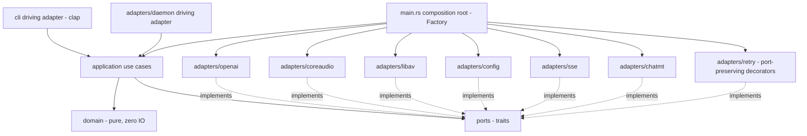

# Hexagonal architecture with DDD and named GoF patterns

## Context and Problem Statement

`speak` grew from a flat set of modules (`client.rs`, `codec.rs`,
`audio_macos.rs`, `daemon.rs`, ...) wired directly together. As the feature
set expands — multiple transports (one-shot HTTP and a persistent daemon),
multiple translation strategies, multi-device output fan-out, an SSE realtime
pipeline — the direct coupling between the CLI, the HTTP client, and the
native audio code makes the system hard to test in isolation and hard to
evolve one concern without disturbing another. We need an architecture that
isolates business rules from frameworks (async-openai, CoreAudio, libav, clap,
TOML) and makes the reusable structure explicit and auditable.

## Decision Drivers

- Business rules (voice modes, config precedence, realtime pipeline modes)
  must not depend on any concrete framework type.
- The same use case must run unchanged behind both the one-shot CLI path and
  the daemon path.
- Adapters (HTTP, audio, codec, config, socket) must be swappable and
  unit-testable behind narrow interfaces.
- The reusable design must be named and recorded, not incidental.
- Dependencies must point in one direction so the compiler enforces the
  boundary (no cycles).

## Considered Options

- Option A — Hexagonal (Ports & Adapters) + DDD tactical patterns + explicitly
  named GoF patterns, with `domain <- application <- adapters` dependency flow.
- Option B — Keep the flat module layout, add traits ad hoc where testing hurts.
- Option C — Layered n-tier (presentation/service/data) without a pure domain.

## Decision Outcome

Chosen option: "Option A".

### Layering

Dependencies point strictly inward; the `hexagonal-model` validator's layer
matrix and cycle check (tarjan-scc) enforce acyclicity.

The root constructs every driven adapter (`openai`, `coreaudio`, `libav`,
`config`, `sse`, `chatmt`) and wraps each network adapter in its port-preserving
`retry` decorator before injecting it into the use cases; the diagram wires
`MAIN` to all of them so the Factory's object graph is fully represented.

- `src/domain/` — pure, zero I/O: `Voice`, `VoiceDesign` (the 23-tag canonical
  Value Object), `VoiceClone`, `StandardVoice` (a named built-in voice such as
  the `[tts].voice` default `alloy`, distinct from a saved clone — the third
  `VoiceMode` arm), `PcmBuffer`, `SampleFormat`, `SpeechSpec`,
  `GenParams`, `Language`, `RetryPolicy` (the exponential-backoff + jitter
  resilience value object, with its `RetryOn` classification), and domain
  `errors`. No `tokio`, `reqwest`, `objc2`, or `ffmpeg` types appear here.
- `src/ports/` — driven-port traits: `Synthesizer`, `Transcriber`,
  `Translator`, `AudioSink`, `AudioSource`, `AudioDecoder`, `AudioEncoder`
  (WAV/FLAC record output), `ConfigProvider`, `VoiceRepository`,
  `RealtimeStream`, `ServerProbe` (the capability/health port for `GET /health`,
  `GET /v1/models`, and the runtime `POST /v1/realtime/translate` probe of
  FR-14 / ADR-0004), and `RetryPolicy` (the resilience Strategy port consulted
  by the retry decorators; ADR-0004).
- `src/application/` — use cases (`say`, `transcribe`, `translate`, `record`,
  `voices`, `realtime`, `check`/`health`) that orchestrate ports; no framework
  type leaks across the application boundary. The `check`/`health` use case
  drives the `ServerProbe` port and the `accel` cross-cutting probe;
  `config`/`devices`/`completions` stay thin CLI adapters with no dedicated use
  case.
- `src/adapters/` — `openai` (async-openai + `_byot`), `coreaudio`
  (`AVAudioEngine` output + mixer + capture + device enumeration + multi-output),
  `libav` (ffmpeg-the-third decode/resample + WAV/FLAC record encode), `chatmt`
  (arbitrary-target `Translator` Strategy over `[http].translate_url`),
  `config` (TOML + env + default), `daemon` (Unix socket + SSE forward), `sse`
  (realtime stream parser), `retry` (port-preserving decorators that wrap every
  network adapter and consult the `RetryPolicy` Strategy; ADR-0004).
- `src/cli/` — driving adapter (clap) that maps arguments to use-case inputs and
  contains no business logic.
- `src/main.rs` — composition root that wires adapters into use cases (DI).

### Named GoF patterns (recorded for `gof-conformance`)

- Adapter — every `adapters/*` type adapts a framework to a port trait.
- Strategy — translation modes (`translate` / `no-translate` passthrough /
  `echo`), the resampler selection, and the `RetryPolicy` resilience port
  (exponential backoff + jitter, configured from `[retry]` and injected at the
  composition root) are interchangeable strategies.
- Factory — `main.rs` composition root constructs and wires the object graph.
- Builder — speech request assembly and config assembly use fluent builders.
- Facade — an application facade exposes one cohesive surface to both the CLI
  and the daemon.
- Repository — `VoiceRepository` abstracts saved-voice persistence on the server.

### Cross-cutting concerns

The acceleration probe (`accel`) and rotating logging (`logging`) of ADR-0002
are cross-cutting concerns. They are invoked from the composition root
(`main.rs`) and wired around the use cases rather than reached through a driven
port. This is a deliberate hexagonal cross-cutting treatment, not an
inward-dependency exception: the domain and application layers never call them;
the root configures logging before constructing the object graph and exposes
the probe to the `check` use case as plain data, so no framework type crosses
the application boundary.

### Consequences

- Good: the domain is unit-testable with no I/O; adapters are swappable; the
  daemon and CLI share identical use cases; the layer matrix is machine-checked.
- Good: GoF roles are named in one place, so reviewers can verify intent.
- Bad: more files and trait indirection than the flat layout; the existing
  flat modules must be refactored into the layered tree (tracked in `tasks.md`).

## Refinement (2026-06-26, Validate phase)

The crate is now a **library core (`src/lib.rs`) plus a thin binary
(`src/main.rs`)** rather than a bin-only crate. `main.rs` is the clap driving
adapter and composition root; it depends on the library via `use speak::…` and
holds no reusable logic beyond CLI mapping. This makes the inward modules
(`domain`, `ports`, `adapters`, `config`, `client`, `daemon`, `transport`,
`accel`, `paths`, `audio`) a reusable, directly testable surface and lets the
configuration catalog's forward-looking value objects be reachable `pub` API
(rather than bin-private dead code).

The rebuild is landing layer by layer. The pure `domain/` is now populated with
the value objects described above — `VoiceDesign`, `GenParams`, `RetryPolicy`,
plus `Language`, `SampleFormat`/`PcmBuffer`, `Voice`/`VoiceClone`/`StandardVoice`/
`VoiceMode`, `AudioFormat`, `RealtimeMode`, the `SpeechSpec` aggregate (assembled
through a fluent Builder), and the `DomainError` failure vocabulary — and the
`ports/` driven-port traits (`Synthesizer`, `Transcriber`, `Translator`,
`AudioSink`, `AudioSource`, `AudioDecoder`, `AudioEncoder`, `ConfigProvider`,
`VoiceRepository`, `RealtimeStream`, `ServerProbe`, and the `RetryPolicy`
Strategy) now exist and compile clippy-clean, referencing only domain types
(plus the still-flat resolved `config::Config` POD, which moves inward with the
config adapter).

The first driven adapter has landed: `src/adapters/openai/` (`OpenAiAdapter`)
implements the `Synthesizer`, `Transcriber`, `Translator`, and `VoiceRepository`
ports over the OpenAI-compatible server (T030-T032). It is the only place
`async-openai`/`reqwest` types appear behind these ports. Two realities forced a
refinement of ADR-0004's "_byot speech via async-openai" wording: (1)
`async-openai` 0.41 provides no non-streaming speech "bring-your-own-types"
method and its `Speech::create` discards the `X-RTF`/`X-Audio-Seconds` response
headers FR-1 needs, so the Synthesizer keeps the "bring your own types" spirit by
serializing a `speak`-owned `SpeechBody` (a fluent **Builder** maps the domain
`VoiceMode` Strategy to the wire fields and flattens the gen-params) and posting
it over the adapter's tuned warm `reqwest` pool; the typed transcription /
translation groups (`create_raw`) are used as-is. (2) `async-openai` 0.41 links
`reqwest` 0.13 while this crate is on 0.12, so one `reqwest::Client` instance
cannot back both the typed and raw paths — the adapter holds a tuned 0.12 pool
for the raw calls and lets `async-openai` build its own; unifying them is a
composition-root concern (T054). Retry is intentionally NOT baked into the
adapter: the port-preserving decorator (T046) wraps it at the root.

The second driven adapter has landed: `src/adapters/libav/` (`LibavCodec`)
implements the `AudioDecoder` and `AudioEncoder` ports (T033/T038). The libav
FFI moved wholesale out of the flat `src/codec.rs` (now deleted) into this
adapter, so `ffmpeg-the-third` no longer appears outside `adapters/` — the
in-memory AVIO read (decode/resample) and the new in-memory AVIO **write** path
(the libavcodec FLAC encoder + `.flac` muxer with a seekable sink, plus the
hand-muxed WAV) both live here. The canonical in-memory PCM type collapsed onto
the pure `domain::pcm::PcmBuffer` (the duplicate `codec::Pcm` is gone); the
adapter's lower-level free functions (`decode`, `to_asr_mono16`, `wav_mono16`,
`rms_s16`, the rate/channel constants) stay re-exported for the still-flat
realtime path until it moves onto the ports (T044/T055).

The third driven adapter has landed: `src/adapters/coreaudio/` (`CoreAudio`)
implements the `AudioSink` and `AudioSource` ports (T034/T035). The AVFAudio FFI
moved wholesale out of the flat `src/audio_macos.rs`/`audio_stub.rs` (now
deleted) into this adapter, so `objc2`/AVFAudio/CoreAudio-HAL types no longer
appear outside `adapters/`. The macOS backend (AVAudioEngine playback + mic
capture + `kAudioHardwarePropertyDevices` enumeration + the multi-output fan-out
that pins one engine per device via `AudioUnitSetProperty(CurrentDevice)`) sits
behind a cfg gate against a clear-error stub for other platforms. Device
descriptors gained `uid`/`sample_rate`/`is_default_*` so `speak devices` (T056)
can surface FR-10; the `AudioDeviceId` newtype is the only HAL value crossing the
port (a documented `u32` selector, not a live CoreAudio handle).

The `application/` layer has now landed (`src/application/`, T040-T047): the
`say`, `transcribe`, `translate`, `voices`, `record`, `realtime`, and
`check`/`health` use cases plus the `SpeakFacade` (T045) that exposes one
cohesive surface to both driving adapters. Each use case is generic over the
driven ports it needs (the simpler ones over individual ports; `realtime` and the
Facade over the three adapter-role bundles `Speech`/`Audio`/`Codec` that mirror
the real composition), so the layer is fully unit-testable with in-memory port
doubles and **no** `reqwest`/`ffmpeg`/`objc2`/`async-openai` type crosses the
application boundary — only `anyhow::Result`, the domain value objects, and the
port DTOs. The `say`/`realtime` playback routing (single device or N-device
fan-out) is centralised in one `application::playback` helper to avoid
duplication; the realtime silence gate is a pure RMS over the domain `PcmBuffer`.
The cross-cutting `accel` probe is folded into the `check` use case as plain
data, never reached through a port (preserving the inward dependency rule). To
let the `check`/`health` use case bind to a real adapter, the `openai` adapter's
`ServerProbe` impl also landed (`GET /health`, `GET /v1/models`, the
`POST /v1/realtime/translate` runtime capability probe), live-verified against
solaris. The remaining `adapters/*` (config, sse, chatmt, retry) split, the CLI
wiring of each subcommand onto the Facade (T051/T055), the daemon-forward
unification (T053), and the composition root (T054) are still tracked in
`tasks.md`; the CLI `say`/`transcribe`/`translate`/`voices` paths drive the
`openai` ports directly in-process today. This ADR section records the lib/bin
boundary, the ports + domain landing, the first three driven adapters, and the
application use-case + Facade layer as concrete steps toward the full layout.

The Validate phase added a real test suite exercising this core: domain
value-object units (voice-design tag validation, gen-param keys, retry/backoff
policy), the `flag > env > toml > default` precedence engine and per-key
origins, adapter tests (the `_byot` speech-request body shape, daemon
length-prefixed framing over a `UnixStream` pair, libav WAV/RMS helpers, path
and acceleration resolution), and a binary-driven CLI suite. A feature-gated
`integration` suite talks to the live server and skips with a note when it is
unreachable. See the README "Testing" section for the commands and the CI gate.
