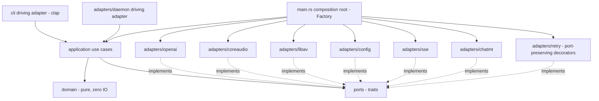

# Hexagonal architecture with DDD and named GoF patterns

## Context and Problem Statement

`speak` grew from a flat set of modules (`client.rs`, `codec.rs`,
`audio_macos.rs`, `daemon.rs`, ...) wired directly together. As the feature
set expands — multiple transports (one-shot HTTP and a persistent daemon),
multiple translation strategies, multi-device output fan-out, an SSE realtime
pipeline — the direct coupling between the CLI, the HTTP client, and the
native audio code makes the system hard to test in isolation and hard to
evolve one concern without disturbing another. We need an architecture that
isolates business rules from frameworks (async-openai, CoreAudio, libav, clap,
TOML) and makes the reusable structure explicit and auditable.

## Decision Drivers

- Business rules (voice modes, config precedence, realtime pipeline modes)
  must not depend on any concrete framework type.
- The same use case must run unchanged behind both the one-shot CLI path and
  the daemon path.
- Adapters (HTTP, audio, codec, config, socket) must be swappable and
  unit-testable behind narrow interfaces.
- The reusable design must be named and recorded, not incidental.
- Dependencies must point in one direction so the compiler enforces the
  boundary (no cycles).

## Considered Options

- Option A — Hexagonal (Ports & Adapters) + DDD tactical patterns + explicitly
  named GoF patterns, with `domain <- application <- adapters` dependency flow.
- Option B — Keep the flat module layout, add traits ad hoc where testing hurts.
- Option C — Layered n-tier (presentation/service/data) without a pure domain.

## Decision Outcome

Chosen option: "Option A".

### Layering

Dependencies point strictly inward; the `hexagonal-model` validator's layer
matrix and cycle check (tarjan-scc) enforce acyclicity.

The root constructs every driven adapter (`openai`, `coreaudio`, `libav`,
`config`, `sse`, `chatmt`) and wraps each network adapter in its port-preserving
`retry` decorator before injecting it into the use cases; the diagram wires
`MAIN` to all of them so the Factory's object graph is fully represented.

- `src/domain/` — pure, zero I/O: `Voice`, `VoiceDesign` (the 23-tag canonical
  Value Object), `VoiceClone`, `StandardVoice` (a named built-in voice such as
  the `[tts].voice` default `alloy`, distinct from a saved clone — the third
  `VoiceMode` arm), `PcmBuffer`, `SampleFormat`, `SpeechSpec`,
  `GenParams`, `Language`, `RetryPolicy` (the exponential-backoff + jitter
  resilience value object, with its `RetryOn` classification), and domain
  `errors`. No `tokio`, `reqwest`, `objc2`, or `ffmpeg` types appear here.
- `src/ports/` — driven-port traits: `Synthesizer`, `Transcriber`,
  `Translator`, `AudioSink`, `AudioSource`, `AudioDecoder`, `AudioEncoder`
  (WAV/FLAC record output), `ConfigProvider`, `VoiceRepository`,
  `RealtimeStream`, `ServerProbe` (the capability/health port for `GET /health`,
  `GET /v1/models`, and the runtime `POST /v1/realtime/translate` probe of
  FR-14 / ADR-0004), and `RetryPolicy` (the resilience Strategy port consulted
  by the retry decorators; ADR-0004).
- `src/application/` — use cases (`say`, `transcribe`, `translate`, `record`,
  `voices`, `realtime`, `check`/`health`) that orchestrate ports; no framework
  type leaks across the application boundary. The `check`/`health` use case
  drives the `ServerProbe` port and the `accel` cross-cutting probe;
  `config`/`devices`/`completions` stay thin CLI adapters with no dedicated use
  case.
- `src/adapters/` — `openai` (async-openai + `_byot`), `coreaudio`
  (`AVAudioEngine` output + mixer + capture + device enumeration + multi-output),
  `libav` (ffmpeg-the-third decode/resample + WAV/FLAC record encode), `chatmt`
  (arbitrary-target `Translator` Strategy over `[http].translate_url`),
  `config` (TOML + env + default), `daemon` (Unix socket + SSE forward), `sse`
  (realtime stream parser), `retry` (port-preserving decorators that wrap every
  network adapter and consult the `RetryPolicy` Strategy; ADR-0004).
- `src/cli/` — driving adapter (clap) that maps arguments to use-case inputs and
  contains no business logic.
- `src/main.rs` — composition root that wires adapters into use cases (DI).

### Named GoF patterns (recorded for `gof-conformance`)

- Adapter — every `adapters/*` type adapts a framework to a port trait.
- Strategy — translation modes (`translate` / `no-translate` passthrough /
  `echo`), the resampler selection, and the `RetryPolicy` resilience port
  (exponential backoff + jitter, configured from `[retry]` and injected at the
  composition root) are interchangeable strategies.
- Factory — `main.rs` composition root constructs and wires the object graph.
- Builder — speech request assembly and config assembly use fluent builders.
- Facade — an application facade exposes one cohesive surface to both the CLI
  and the daemon.
- Repository — `VoiceRepository` abstracts saved-voice persistence on the server.

### Cross-cutting concerns

The acceleration probe (`accel`) and rotating logging (`logging`) of ADR-0002
are cross-cutting concerns. They are invoked from the composition root
(`main.rs`) and wired around the use cases rather than reached through a driven
port. This is a deliberate hexagonal cross-cutting treatment, not an
inward-dependency exception: the domain and application layers never call them;
the root configures logging before constructing the object graph and exposes
the probe to the `check` use case as plain data, so no framework type crosses
the application boundary.

### Consequences

- Good: the domain is unit-testable with no I/O; adapters are swappable; the
  daemon and CLI share identical use cases; the layer matrix is machine-checked.
- Good: GoF roles are named in one place, so reviewers can verify intent.
- Bad: more files and trait indirection than the flat layout; the existing
  flat modules must be refactored into the layered tree (tracked in `tasks.md`).

## Refinement (2026-06-26, Validate phase)

The crate is now a **library core (`src/lib.rs`) plus a thin binary
(`src/main.rs`)** rather than a bin-only crate. `main.rs` is the clap driving
adapter and composition root; it depends on the library via `use speak::…` and
holds no reusable logic beyond CLI mapping. This makes the inward modules
(`domain`, `config`, `client`, `codec`, `daemon`, `transport`, `accel`,
`paths`, `audio`) a reusable, directly testable surface and lets the
configuration catalog's forward-looking value objects be reachable `pub` API
(rather than bin-private dead code).

The current module layout is still the flat tree (`domain/` holds the
`VoiceDesign`, `GenParams`, and `RetryPolicy` value objects; the other concerns
are top-level modules), not yet the full `ports/`–`application/`–`adapters/`
split described above. That refactor remains tracked in `tasks.md`; this ADR
section records the lib/bin boundary as the first concrete step toward it.

The Validate phase added a real test suite exercising this core: domain
value-object units (voice-design tag validation, gen-param keys, retry/backoff
policy), the `flag > env > toml > default` precedence engine and per-key
origins, adapter tests (the `_byot` speech-request body shape, daemon
length-prefixed framing over a `UnixStream` pair, libav WAV/RMS helpers, path
and acceleration resolution), and a binary-driven CLI suite. A feature-gated
`integration` suite talks to the live server and skips with a note when it is
unreachable. See the README "Testing" section for the commands and the CI gate.
