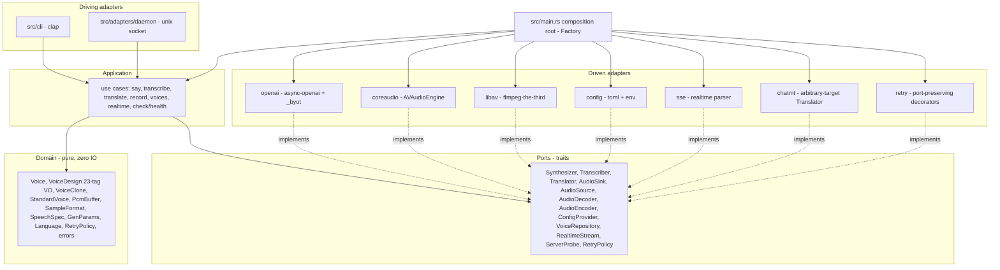

# Implementation Plan: speak

## Overview

Build `speak`, a single Rust binary network client for the OpenAI-compatible
speech server at `http://solaris:8800` (OmniVoice TTS + faster-whisper ASR).
Goal: TTS (with voice design, cloning, voice management, gen-param tuning), STT,
audio translation, a realtime microphone pipeline (SSE or chunked), recording,
device discovery, multi-output routing, and an optional warm-connection daemon —
all in-process for media, trivially configurable, organized as Hexagonal +
DDD + named GoF patterns (ADR-0003).

## Technical Approach

- Rust: currently edition 2021, `rust-version = 1.85`; the **required target** is
  edition 2024 / resolver 3 / `rust-version = 1.95` with a pinned
  `rust-toolchain.toml` (`channel = 1.95`). async via **tokio**. Staying on
  edition 2021 (rather than the toolchain-standard 2024) is a recorded,
  time-bounded deferral — the `[tts.gen]` `gen` identifier collides with the
  2024 reserved keyword; the migration (edition + MSRV bump + toolchain pin) is
  owned by the `adapters/config` rebuild (T037). See ADR-0008.
- HTTP via **async-openai** 0.41.x (`OpenAIConfig::with_api_base(host)
  .with_api_key(key)`): typed requests for standard endpoints, `_byot` methods
  for the extended speech request (voice-design `instruct`, `voice=clone`,
  `ref_text`, gen-params); **eventsource-stream** for the realtime SSE
  (ADR-0004). One warm pooled client reused everywhere.
- **clap** (derive) CLI with `ValueEnum` choices, `env=`-aware global flags,
  `arg_required_else_help`, `propagate_version`, and a `completions` subcommand
  (`clap_complete`); **serde + toml** config; **anyhow** errors; **tracing**
  rotating logs.
- **In-process media, no exec** (ADR-0001): `ffmpeg-the-third` (libav FFI) for
  codecs + resampling via a custom in-memory AVIO callback; native macOS
  CoreAudio (`objc2-avf-audio` `AVAudioEngine`) for output, mixing, capture,
  device enumeration, and multi-output fan-out (ADR-0007).
- **Resilience** (ADR-0004): every network call rides a single configurable
  `RetryPolicy` Strategy (domain value object + port) — bounded exponential
  backoff + jitter from the `[retry]` catalog — injected at the composition
  root; the realtime SSE stream reconnects under the same bounded policy.
- **Zero magic numbers**: every tunable is a `SPEAK_*`-overridable knob with a
  code default under `flag > env > toml > default`; the Validate phase greps
  for hardcoded tunables and asserts the retry policy is env-driven + tested.

## Hexagonal module plan

Dependencies point inward only; the `hexagonal-model` validator checks the
layer matrix and rejects cycles.

### Layers and modules

- **domain** (`src/domain/`) — `Voice`, `VoiceDesign` (canonical 23-tag Value
  Object with validation), `VoiceClone`, `StandardVoice` (named built-in voice,
  the third `VoiceMode` arm reconciling the `[tts].voice`/`alloy` default with
  saved-clone lookup), `PcmBuffer`, `SampleFormat`, `SpeechSpec`, `GenParams`,
  `Language`, `RetryPolicy` (exponential-backoff + jitter resilience VO with its
  `RetryOn` classification and an injected RNG so jitter stays pure/testable),
  domain `errors`.
  Pure; no `tokio`, `reqwest`, `objc2`, or `ffmpeg` types.
- **ports** (`src/ports/`) — `Synthesizer`, `Transcriber`, `Translator`,
  `AudioSink`, `AudioSource`, `AudioDecoder`, `AudioEncoder` (WAV/FLAC record
  output), `ConfigProvider`, `VoiceRepository`, `RealtimeStream`, `ServerProbe`
  (the capability/health port for `GET /health`, `GET /v1/models`, and the
  runtime `POST /v1/realtime/translate` probe of FR-14), `RetryPolicy` (the
  resilience Strategy the retry decorators consult), and `Presenter` (the output
  port carrying structured `Report`/`Table`/`line` results, ADR-0009) traits.
- **application** (`src/application/`) — use cases `say`, `transcribe`,
  `translate`, `record`, `voices`, `realtime`, `check`/`health`; orchestrate
  ports; no framework types leak across the boundary. The `check`/`health` use
  case drives the `ServerProbe` port plus the `accel` cross-cutting probe;
  `config`/`devices`/`completions` are thin CLI adapters with no dedicated use
  case. An application **Facade** exposes one surface to both CLI and daemon.
  The `say` use case resolves a bare `-o` filename under `[http].save_dir`
  (`SPEAK_SAVE_DIR`, default the CWD) and, on `--json`, surfaces the server's
  `X-RTF` / `X-Audio-Seconds` inference-timing headers when present (FR-1).
- **adapters** (`src/adapters/`):
  - `openai` — async-openai client; typed + `_byot`; implements `Synthesizer`,
    `Transcriber`, `Translator`, `VoiceRepository`.
  - `coreaudio` — `AVAudioEngine` output + `mainMixerNode` + `inputNode` tap +
    device enumeration + multi-output; implements `AudioSink`, `AudioSource`.
  - `libav` — custom in-memory AVIO decode -> PCM, libswresample resample (48 kHz
    stereo f32 for playback, 16 kHz mono s16 for ASR), in-memory WAV mux, RMS
    silence gate; plus the **encode** direction for `record` output — hand-muxed
    WAV (no encoder) and FLAC via the libavcodec FLAC encoder through an
    in-memory AVIO **write** callback (`record --format wav|flac`, FR-9). The
    port surface is an `AudioDecoder` for the decode/resample side and an
    `AudioEncoder` for the WAV/FLAC encode side (ADR-0001).
  - `chatmt` — chat machine-translation adapter implementing the `Translator`
    port's arbitrary-target **Strategy** against the non-OpenAI
    `[http].translate_url` endpoint (`[http].translate_model`), reusing the warm
    pool; selected only when `--to` is non-English and `translate_url` is set
    (ADR-0004). The default English path stays on the `openai` adapter.
  - `retry` — transport-agnostic, **port-preserving** decorators: one generic
    wrapper per driven port (`Synthesizer`, `Transcriber`, `Translator`,
    `VoiceRepository`, `RealtimeStream`, `ServerProbe`) that
    **implements the same port it wraps** and consults the `RetryPolicy`
    Strategy (bounded exponential backoff + jitter from `[retry]`, `retry_on`
    classification). The decorator is NOT the `RetryPolicy` port; it is
    substitutable for the concrete adapter the use case holds, and is wired at
    the composition root (ADR-0004). The CLI-side daemon-forward client is not a
    driven port; its retry decorator preserves the application **Facade** surface
    (the `CommandTransport` shared by the in-process and socket-forward paths,
    ADR-0005), retrying the socket connect/forward under the same Strategy.
  - `config` — TOML + env + default precedence; implements `ConfigProvider`.
  - `daemon` — Unix-socket driving adapter (length-prefixed framing, SSE
    pass-through) reusing the same use cases (ADR-0005).
  - `sse` — `eventsource-stream` parser decoding realtime frames into a typed
    `RealtimeFrame`; implements `RealtimeStream` (ADR-0004).
  - `presenter` — `console` (coloured, aligned human text; honours `--quiet` and
    `--color`/`NO_COLOR`) and `json` (machine-readable per FR-16) renderers plus
    a capture buffer for tests; implements the `Presenter` output port (ADR-0009).
- **cli** (`src/cli/`) — clap driving adapter; maps args to use-case inputs;
  emits results through the `Presenter` port (never raw `println!`); zero
  business logic.
- **composition root** (`src/main.rs`) — **Factory** wires adapters into use
  cases (DI) and builds the one warm client.

### Cross-cutting (retained from current code)

- `accel` (probe / `speak check`) and `logging` (rotating `~/.speak/logs`) are
  cross-cutting concerns invoked by the composition root (ADR-0002). Per ADR-0009,
  command RESULTS go to stdout through the `Presenter` port while DIAGNOSTICS go
  to stderr (verbosity-gated) and the rotating log via `tracing` — the two
  streams never interleave and no raw `println!`/`eprintln!` is used.
- Layout note (2026-06-27, ADR-0003 refinement / T064): the `accel` probe now
  lives in the `libav` adapter (`adapters/libav/accel.rs`, its only `ffmpeg-the-
  third` sibling) and is still consumed by the `check` use case as plain
  cross-cutting data, never through a port; only `logging`/`paths` remain as
  flat-root cross-cutting helpers. The warm HTTP client, config resolver, and
  daemon socket likewise moved under `adapters/` (`http`, `config`, `daemon`), so
  framework crates are confined to `adapters/` and `cli/`.

## Realtime pipeline

mic chunk (native CoreAudio tap, `--chunk`, silence-split via RMS gate) ->
libav resample to 16 kHz mono + in-memory WAV -> ASR(`--from`) -> mode:
`--translate` (Whisper translate to EN, or chat MT when `translate_url` set) |
`--no-translate` (passthrough re-voice ASR->TTS) | `--echo` (raw playback then
re-voice) -> TTS in the chosen output voice (`--instruct` design / `--voice`
clone / default) -> native CoreAudio output, routed to one or many
`--output-device`(s). When `POST /v1/realtime/translate` is available the SSE
frames drive the loop directly; otherwise the chunked path runs. Loops to Ctrl-C.

## GoF patterns (named for `gof-conformance`)

- **Adapter** — every `adapters/*` type adapts a framework to a port.
- **Strategy** — translate modes (`translate`/`no-translate`/`echo`), resampler
  selection, the `RetryPolicy` resilience port (interchangeable backoff/jitter
  strategies, injected at the root), and the `Presenter` output port
  (`console | json | buffer` renderers selected at the root, ADR-0009).
- **Factory** — `main.rs` composition root.
- **Builder** — fluent speech-request, config, and `Report`/`Table` assembly.
- **Facade** — application facade shared by CLI and daemon.
- **Repository** — `VoiceRepository` for saved voices.

## Performance

- One pooled async-openai/reqwest client per process (and per daemon), warm
  keep-alive (tuned pool size, TCP keep-alive, idle timeout), reused across every
  request including each realtime iteration.
- libav decoding uses all local CPU cores where the codec supports frame
  threading; on macOS `auto`, AudioToolbox `*_at` decoders are used when present
  (ADR-0002). Audio has no GPU path — that hardware is the server's RTX 4090.

## Companion Artifacts

- `docs/arch/schemas/*.cue` — domain value objects (`SpeechSpec` aggregate,
  `VoiceMode`/`Design`/`Clone`/`StandardVoice`, `Voice`, `GenParams`,
  `PcmBuffer`, `Language`,
  `SampleFormat`, `RealtimeMode`, `ConfigOrigin`, `RetryPolicy`/`RetryOn`) and
  the full `#Config` catalog mirroring ADR-0006 (`config.cue`, including the
  `#Retry` and `#Http` sections); `RealtimeFrame` SSE DTO included.
- `docs/arch/specs/features/*.feature` — executable acceptance scenarios.
- `docs/arch/adr/0001..0010` — the binding decision record (ADR-0008 records
  the edition-2021 deferral; ADR-0009 records the `Presenter` output port +
  `tracing` diagnostics discipline; ADR-0010 records the daemon single-instance
  PID-file lock, the upstream health watchdog with self-recovery, and the daemon
  Facade holding the same target-routed in-process speech composite as the CLI so
  a forwarded non-English translate honours `--to`, plus `translate --format
  srt|vtt` subtitle output from the transcription segments).
