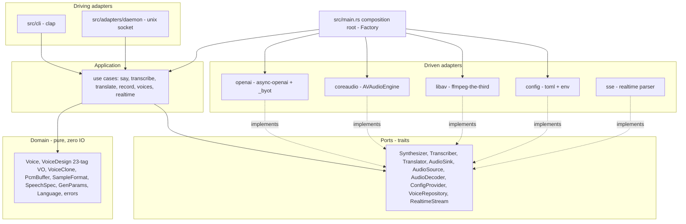

# Implementation Plan: speak

## Overview

Build `speak`, a single Rust binary network client for the OpenAI-compatible
speech server at `http://solaris:8800` (OmniVoice TTS + faster-whisper ASR).
Goal: TTS (with voice design, cloning, voice management, gen-param tuning), STT,
audio translation, a realtime microphone pipeline (SSE or chunked), recording,
device discovery, multi-output routing, and an optional warm-connection daemon —
all in-process for media, trivially configurable, organized as Hexagonal +
DDD + named GoF patterns (ADR-0003).

## Technical Approach

- Rust 2021 edition, MSRV 1.85; async via **tokio**.
- HTTP via **async-openai** 0.41.x (`OpenAIConfig::with_api_base(host)
  .with_api_key(key)`): typed requests for standard endpoints, `_byot` methods
  for the extended speech request (voice-design `instruct`, `voice=clone`,
  `ref_text`, gen-params); **eventsource-stream** for the realtime SSE
  (ADR-0004). One warm pooled client reused everywhere.
- **clap** (derive) CLI with `ValueEnum` choices, `env=`-aware global flags,
  `arg_required_else_help`, `propagate_version`, and a `completions` subcommand
  (`clap_complete`); **serde + toml** config; **anyhow** errors; **tracing**
  rotating logs.
- **In-process media, no exec** (ADR-0001): `ffmpeg-the-third` (libav FFI) for
  codecs + resampling via a custom in-memory AVIO callback; native macOS
  CoreAudio (`objc2-avf-audio` `AVAudioEngine`) for output, mixing, capture,
  device enumeration, and multi-output fan-out (ADR-0007).

## Hexagonal module plan

Dependencies point inward only; the `hexagonal-model` validator checks the
layer matrix and rejects cycles.

### Layers and modules

- **domain** (`src/domain/`) — `Voice`, `VoiceDesign` (canonical 23-tag Value
  Object with validation), `VoiceClone`, `PcmBuffer`, `SampleFormat`,
  `SpeechSpec`, `GenParams`, `Language`, domain `errors`. Pure; no `tokio`,
  `reqwest`, `objc2`, or `ffmpeg` types.
- **ports** (`src/ports/`) — `Synthesizer`, `Transcriber`, `Translator`,
  `AudioSink`, `AudioSource`, `AudioDecoder`, `ConfigProvider`,
  `VoiceRepository`, `RealtimeStream` traits.
- **application** (`src/application/`) — use cases `say`, `transcribe`,
  `translate`, `record`, `voices`, `realtime`; orchestrate ports; no framework
  types leak across the boundary. An application **Facade** exposes one surface
  to both CLI and daemon.
- **adapters** (`src/adapters/`):
  - `openai` — async-openai client; typed + `_byot`; implements `Synthesizer`,
    `Transcriber`, `Translator`, `VoiceRepository`.
  - `coreaudio` — `AVAudioEngine` output + `mainMixerNode` + `inputNode` tap +
    device enumeration + multi-output; implements `AudioSink`, `AudioSource`.
  - `libav` — custom in-memory AVIO decode -> PCM, libswresample resample (48 kHz
    stereo f32 for playback, 16 kHz mono s16 for ASR), in-memory WAV mux, RMS
    silence gate; implements `AudioDecoder`.
  - `config` — TOML + env + default precedence; implements `ConfigProvider`.
  - `daemon` — Unix-socket driving adapter (length-prefixed framing, SSE
    pass-through) reusing the same use cases (ADR-0005).
  - `sse` — `eventsource-stream` parser decoding realtime frames into a typed
    `RealtimeFrame`; implements `RealtimeStream` (ADR-0004).
- **cli** (`src/cli/`) — clap driving adapter; maps args to use-case inputs;
  zero business logic.
- **composition root** (`src/main.rs`) — **Factory** wires adapters into use
  cases (DI) and builds the one warm client.

### Cross-cutting (retained from current code)

- `accel` (probe / `speak check`) and `logging` (rotating `~/.speak/logs`) are
  cross-cutting concerns invoked by the composition root (ADR-0002).

## Realtime pipeline

mic chunk (native CoreAudio tap, `--chunk`, silence-split via RMS gate) ->
libav resample to 16 kHz mono + in-memory WAV -> ASR(`--from`) -> mode:
`--translate` (Whisper translate to EN, or chat MT when `translate_url` set) |
`--no-translate` (passthrough re-voice ASR->TTS) | `--echo` (raw playback then
re-voice) -> TTS in the chosen output voice (`--instruct` design / `--voice`
clone / default) -> native CoreAudio output, routed to one or many
`--output-device`(s). When `POST /v1/realtime/translate` is available the SSE
frames drive the loop directly; otherwise the chunked path runs. Loops to Ctrl-C.

## GoF patterns (named for `gof-conformance`)

- **Adapter** — every `adapters/*` type adapts a framework to a port.
- **Strategy** — translate modes (`translate`/`no-translate`/`echo`) and
  resampler selection.
- **Factory** — `main.rs` composition root.
- **Builder** — fluent speech-request and config assembly.
- **Facade** — application facade shared by CLI and daemon.
- **Repository** — `VoiceRepository` for saved voices.

## Performance

- One pooled async-openai/reqwest client per process (and per daemon), warm
  keep-alive (tuned pool size, TCP keep-alive, idle timeout), reused across every
  request including each realtime iteration.
- libav decoding uses all local CPU cores where the codec supports frame
  threading; on macOS `auto`, AudioToolbox `*_at` decoders are used when present
  (ADR-0002). Audio has no GPU path — that hardware is the server's RTX 4090.

## Companion Artifacts

- `docs/arch/schemas/*.cue` — domain + config value-object model.
- `docs/arch/specs/features/*.feature` — executable acceptance scenarios.
- `docs/arch/adr/0001..0007` — the binding decision record.
