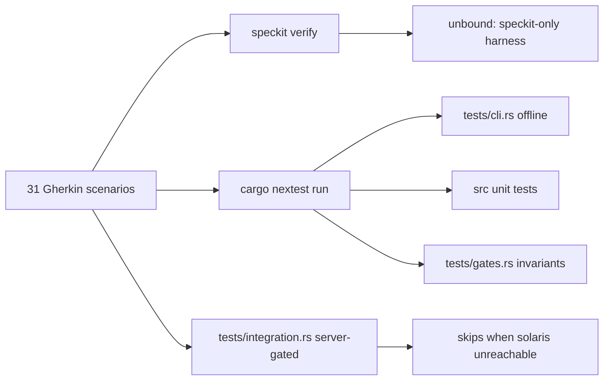

# Acceptance coverage map

Traceability between the Gherkin acceptance corpus
(`docs/arch/specs/features/speak-cli-speech-client-for-solaris-server.feature`,
31 scenarios) and the executing test corpus under `tests/` and `src/`.

## Why `speckit verify` reports the scenarios as `unbound`

`speckit verify` (ADR-0020) is an executable-Gherkin harness, but — confirmed by
direct investigation — it is **hardwired to re-invoke the `speckit` binary
itself**, in a fresh sandbox per scenario. Its `I run` step only binds when the
first token is the literal `speckit`; any other program is reported `unbound`.

Empirical probe (throwaway speckit project, one feature, three `I run` steps):

| Step | Result |
|---|---|
| `I run "speckit version"` | `passed` (executed) |
| `I run "speak --version"` | `unbound` (not executed) |
| `I run "echo hello"` | `unbound` (not executed) |

There is no config knob, no `current_exe`/`CARGO_BIN` substitution, and no
project-binary setting that retargets the harness at `speak`. The bound step
grammar (the only shapes the harness recognizes) is:

- Preconditions: `a clean project directory` · `an initialized project` ·
  `the speckit binary is installed and on PATH`
- Invocation: `I run "speckit <args>"`
- Assertions: `the exit code is <N>` · `stdout`/`stderr`
  `contains`/`does not contain "<text>"` · `stdout is valid JSON` ·
  `the file "<path>" exists` / `is not created`

Consequence: the 31 `speak` acceptance scenarios **cannot** be executed by
`speckit verify` against real `speak` behavior. Rewriting their `I run` steps to
`speckit …` would make them pass while testing the wrong binary, corrupting the
acceptance corpus, so the scenarios are kept as declared prose and
`speckit verify` continues to report `0 passed / 0 failed / 31 unbound`
(advisory — never a build failure; exit 0).

Acceptance is instead demonstrably covered by the project's own executing test
corpus (`cargo nextest run`), mapped scenario-by-scenario below.

## Verification topology



## Coverage classes

- **OFFLINE** — `tests/cli.rs`, drives the real `speak` binary hermetically; runs
  in the default `cargo nextest run` gate, no server.
- **UNIT** — `#[test]` in `src/`; runs in the default gate.
- **GATE** — `tests/gates.rs` static invariant (e.g. zero media-exec).
- **INTEGRATION** — `tests/integration.rs`, behind `--features integration`;
  probes the server and **skips cleanly** when `SPEAK_HOST` (default
  `http://solaris:8800`) is unreachable.
- **HARDWARE** — needs a live mic / multiple output devices / audio output;
  asserted indirectly by UNIT logic over fakes plus the GATE invariant; the
  end-to-end device path is exercised manually.

## Scenario → assertion map

| # | Scenario | Class | Covering assertions |
|---|---|---|---|
| 1 | Synthesize and play pt-BR speech by default | INTEGRATION + UNIT + HARDWARE | `integration.rs::say_writes_audio_file_without_playing`; `application/say.rs::plays_on_default_device_and_returns_metadata`; `application/facade.rs::say_runs_through_the_facade`; pt-BR default `domain/language.rs::parses_and_normalizes_region_tag`; playback in-process per `gates.rs::zero_media_exec_in_src` |
| 2 | Apply a voice design from canonical tags | OFFLINE + INTEGRATION | `cli.rs::list_designs_prints_canonical_tags_offline`; `domain/voice_design.rs::accepts_canonical_title_case`, `single_tag_is_accepted`; `adapters/openai/speech.rs::design_mode_emits_instruct_without_voice`; `integration.rs::voice_design_say_is_accepted` |
| 3 | Reject a non-canonical voice-design tag | UNIT | `domain/voice_design.rs::rejects_free_text`, `rejects_when_any_tag_is_free_text`, `rejects_empty` (fails before any request) |
| 4 | Clone a saved voice | UNIT + INTEGRATION | `domain/voice.rs::clone_normalizes_blank_ref_text_to_none`, `clone_rejects_empty_name`; `adapters/openai/speech.rs::clone_mode_emits_voice_and_ref_text`; `application/voices.rs::add_then_list_then_remove_round_trips`; `integration.rs::voices_list_succeeds` |
| 5 | Transcribe an audio file to text | OFFLINE + UNIT + INTEGRATION | `cli.rs::invalid_text_format_is_rejected`; `cli/args.rs::text_format_wire_strings`; `adapters/openai/transcription.rs::maps_known_formats_else_json`; `application/transcribe.rs::returns_the_recognized_text`; `integration.rs::say_then_transcribe_round_trips_text` |
| 6 | Translate foreign-language audio to English | UNIT + INTEGRATION | `application/translate.rs::returns_the_translated_text`; `application/facade.rs::transcribe_and_translate_share_the_facade`; `integration.rs::translate_emits_srt_subtitles_from_transcription_segments`, `realtime_sse_streams_transcript_and_audio` (fr→en) |
| 7 | Live translate the microphone until interrupted | UNIT + INTEGRATION + HARDWARE | `application/realtime.rs::translate_mode_revoices_the_translation`, `drive_stream_pumps_each_frame_and_stops_on_done`, `pump_frame_plays_audio_and_surfaces_text`; `cli/realtime.rs::output_language_is_target_when_translating`; `integration.rs::realtime_sse_streams_transcript_and_audio`; mic + Ctrl-C loop is HARDWARE |
| 8 | Re-voice the microphone without translating | UNIT + HARDWARE | `application/realtime.rs::no_translate_mode_revoices_the_transcript`; `cli/realtime.rs::output_language_is_source_when_not_translating`; mic capture is HARDWARE |
| 9 | Fan output out to two devices from a single decode | UNIT + GATE + HARDWARE | `application/say.rs::multiple_devices_fan_out_to_every_target`; in-process (no child proc) per `gates.rs::zero_media_exec_in_src`; two physical devices are HARDWARE |
| 10 | Use the default host with no config and no flags | OFFLINE | `cli.rs::config_show_reports_default_origin_without_overrides` (host `http://solaris:8800`); `adapters/config.rs::resolver_default_host_when_unset`, `default_when_nothing_else_present` |
| 11 | Report each config value and its origin | OFFLINE | `cli.rs::config_show_reports_value_with_env_origin`, `config_show_reports_flag_origin_for_global_flag_env`, `config_show_reports_default_origin_without_overrides`; `adapters/config.rs::origin_display_strings`, `entries_catalog_covers_every_tunable_knob`, `env_beats_toml_and_default`, `flag_beats_everything`, `toml_beats_default_when_no_flag_or_env` |
| 12 | Retry a transient server error with exponential backoff | UNIT | `adapters/retry/decorator.rs::retries_transient_*`; `domain/retry.rs::geometric_delay_growth`, `delay_is_capped`, `jitter_stays_within_bounds`, `attempt_count_respects_max` |
| 13 | Do not retry a non-retryable client error | UNIT | `adapters/retry/decorator.rs::non_retryable_error_fails_immediately`; `domain/retry.rs::non_retryable_kind_never_retries`; `adapters/retry/classify.rs::classifies_http_status_error_*`, `status_range_boundaries` |
| 14 | Reconnect the realtime stream after an SSE drop | UNIT | `adapters/retry/stream.rs::reconnects_after_a_transient_drop`, `normal_end_of_stream_does_not_reconnect` |
| 15 | Override the retry policy from the environment | OFFLINE | `cli.rs::config_show_reports_value_with_env_origin` (`SPEAK_RETRY_MAX`, origin `env`); `adapters/config.rs::resolver_env_overrides_toml_for_retry_max`, `env_beats_toml_and_default` |
| 16 | Forward through the daemon with one-shot fallback | UNIT | `adapters/daemon.rs::forward_round_trips_a_request_over_a_real_socket`, `dispatch_synthesize_routes_through_the_facade`, `request_serde_round_trips`; `adapters/daemon/lifecycle.rs::is_alive_recognises_self_and_rejects_a_phantom_pid` |
| 17 | Save synthesized audio to a file without playing | UNIT + INTEGRATION | `application/say.rs::no_play_skips_the_sink_but_still_synthesizes`; `integration.rs::say_writes_audio_file_without_playing` |
| 18 | Pass generation parameters through to the server | UNIT + INTEGRATION | `domain/gen_params.rs::canonical_key_passes_known_keys_through`, `coerces_scalar_types`, `later_override_wins_for_same_key`, `steps_aliases_to_num_step`; `adapters/genparams.rs::to_json_maps_each_scalar_arm`, `round_trips_through_json`; `adapters/openai/speech.rs::gen_params_flatten_onto_the_body`; `cli/say.rs::gen_to_params_only_emits_set_params`; live forward via INTEGRATION say path |
| 19 | Reject an unknown generation-parameter key | UNIT | `domain/gen_params.rs::rejects_num_steps`, `rejects_unknown_key`, `requires_key_value`, `rejects_empty_value` (fails before any request) |
| 20 | Synthesize through the native tts endpoint | UNIT + INTEGRATION | native `/tts` body rendering `adapters/openai/speech.rs::standard_mode_emits_voice_only`, `core_fields_always_present`; `cli/say.rs::resolve_text_joins_positional_args`; live synth via INTEGRATION say path |
| 21 | Echo the microphone then re-voice it | UNIT + HARDWARE | `application/realtime.rs::echo_mode_plays_raw_then_revoices`; mic capture is HARDWARE |
| 22 | Degrade realtime translation when no chat-MT endpoint is set | UNIT | `adapters/inproc.rs::new_selects_chat_mt_strategy_from_config`; `adapters/chatmt/mod.rs::chat_body_uses_the_given_model_and_normalized_target`, `empty_choices_yields_no_content`; `adapters/config.rs::env_overrides_http_translate_url` |
| 23 | Record the microphone to a FLAC file | OFFLINE + UNIT + HARDWARE | `cli.rs::record_rejects_unknown_format_and_requires_output`; `application/record.rs::records_flac_resampling_to_target_rate_and_channels`, `records_wav_at_capture_rate_without_resampling`; in-process per `gates.rs::zero_media_exec_in_src`; mic capture is HARDWARE |
| 24 | List input and output audio devices as JSON | UNIT | `cli/devices.rs::device_row_exposes_fr`; `adapters/presenter/json.rs::table_is_array_of_row_objects` (runs offline; device list is host-dependent) |
| 25 | Add, list, and remove a saved voice | UNIT + INTEGRATION | `application/voices.rs::add_then_list_then_remove_round_trips`; `application/facade.rs::voices_round_trip_through_the_facade`; `adapters/daemon.rs::dispatch_voices_round_trips_through_the_facade`; `integration.rs::voices_list_succeeds` |
| 26 | Check server health | UNIT + INTEGRATION | `application/check.rs::health_reports_server_state_and_models`; `application/facade.rs::realtime_and_health_through_the_facade`; `adapters/daemon.rs::dispatch_health_reports_the_snapshot`; `adapters/openai/probe.rs::parse_models_collects_ids`; `integration.rs::health_reports_server_status` |
| 27 | Report local acceleration and environment | OFFLINE | `cli.rs::check_reports_host_and_acceleration_offline`; `application/check.rs::check_folds_accel_and_host`; `adapters/libav/accel.rs::policy_defaults_to_auto`, `version_string_unpacks_semver` |
| 28 | Emit a shell completion script | OFFLINE | `cli.rs::completions_zsh_emits_a_script`, `completions_bash_emits_a_script`; `cli/args.rs::cli_definition_is_valid` |
| 29 | Write a fully commented config template | OFFLINE + UNIT | `config init` writes `src/adapters/config_template.toml` (handler `src/cli/config.rs`); catalog parity `adapters/config.rs::entries_catalog_covers_every_tunable_knob`; runs offline deterministically (exit 0; re-run reports `config already exists`) |
| 30 | Print the resolved config path | OFFLINE | `cli.rs::config_path_reports_the_resolved_override` |
| 31 | Stop and query the daemon | UNIT | `adapters/daemon/lifecycle.rs::write_then_read_round_trips_the_pid`, `read_pid_rejects_missing_and_garbage`, `terminate_and_wait_is_a_noop_for_a_dead_pid`, `is_alive_recognises_self_and_rejects_a_phantom_pid`; `daemon status` runs offline (reports `running false`, exit 0) |

Every scenario maps to at least one assertion that executes in `cargo nextest run`
(OFFLINE / UNIT / GATE classes) or in the server-gated integration suite.

## Running the coverage

```bash
export PKG_CONFIG_PATH=/opt/homebrew/lib/pkgconfig:$PKG_CONFIG_PATH
export LIBCLANG_PATH=/opt/homebrew/opt/llvm/lib

# OFFLINE + UNIT + GATE classes (no server, hermetic):
cargo nextest run

# INTEGRATION class (skips cleanly when solaris is unreachable):
cargo nextest run --features integration            # SPEAK_HOST overrides the default

# Advisory Gherkin pass (reports 0/0/31 unbound by design — see top of this file):
speckit verify --json
```
