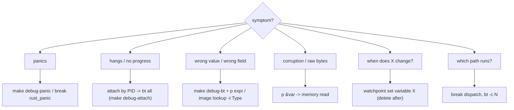

# Debugging guide — headless lldb (CLAUDE.md)

How to debug `speak` (Rust) with breakpoints, variable analysis, and memory dumps
— driven **non-interactively** so an agent (or a script) can extract real runtime
state. Root `CLAUDE.md §10` points here.

The whole point: **read runtime truth instead of guessing from source.** A wrong
field name or an assumed value is where the analysis goes wrong; the debugger
prints the real one (e.g. `cfg->server.timeout = 300`, and it *rejects*
`timeout_secs` as "no member named ...").

---

## 0. THE ONE RULE — never lock yourself in

> A headless `run` that waits for a breakpoint **that never hits** blocks forever.
> Every session must be **bounded** and every breakpoint must be **proven
> reachable** before you `run`.

Four guards, always on:

1. **Hard timeout on every session.** The harness wraps lldb in
   `timeout -s KILL` (default 60s). Never invoke a bare `lldb -o run` that can
   block indefinitely. If you call lldb by hand, prefix `timeout 60`.
2. **Verify the breakpoint resolved BEFORE running.** `breakpoint set` prints the
   location count. `N locations` (N≥1) → it can stop. `no locations (pending)` +
   `WARNING: Unable to resolve breakpoint` → it will **never** stop there → fix the
   spec first. A pending breakpoint is the #1 cause of "it just hangs / exits
   without stopping".
   ```
   Breakpoint 1: 3 locations.                         ✅ will hit
   Breakpoint 2: no locations (pending).              ❌ never hits — wrong file/line/symbol
   WARNING:  Unable to resolve breakpoint to any actual locations.
   ```
3. **Break on a path the args actually execute.** Map command→code first. Breaking
   in `Command::Say` then running `config path` → the breakpoint is unreachable →
   you wait for nothing. `dispatch` (main.rs:111) runs for *every* command; a
   subcommand handler runs only for that subcommand.
4. **A timeout firing is DATA, not just failure.** If the session is killed at the
   timeout, the process was stuck *before* the breakpoint. That localizes a hang:
   re-run as an **attach** (`rust-lldb-attach.sh`) and `bt all` to see exactly which
   syscall/await it is blocked on. Stuck-before-breakpoint ⇒ the bug is upstream of
   your breakpoint.

Corollary — **don't `run` a command that blocks on input/network/audio** under a
batch unless the breakpoint sits *before* the blocking call. `speak say` waits on
the server + CoreAudio; `config path` / `check` / `completions` are pure-local and
safe to run to completion.

---

## 1. Quick start (the harness does the bounding for you)

```bash
# backtrace + real values at a line (args must reach that line!)
make debug-bt LOC='--file main.rs --line 111' ARGS='config path' P='p cfg->server.host'

# run a command, catch a panic, dump backtrace + locals at the panic site
make debug-panic ARGS='say hi'

# all-thread state of the LIVE daemon, read-only — never kills it
make debug-attach            # reads ~/.speak/speak.pid (or PID=1234)

# optimized build that KEEPS symbols (debug release-shaped behaviour)
make build-dbg               # -> target/release-dbg/speak
```

Direct scripts (same flags): `rust-lldb-batch.sh`, `rust-panic-trace.sh`,
`rust-lldb-attach.sh` (this dir).

Every script: hard `timeout`, Rust pretty-printer banner stripped, output starts at
the first process stop.

---

## 2. Breakpoints

```bash
# by file:line
breakpoint set --file main.rs --line 111
# by symbol / function
breakpoint set --name speak::dispatch
breakpoint set --func-regex 'speak::.*::run'        # regex over mangled names
# CONDITIONAL — stop only when it matters (avoids stopping on every hit forever)
breakpoint set --file say.rs --line 40 --condition 'attempts == 3'
# ONE-SHOT — auto-deletes after first hit (no repeated stops)
breakpoint set --one-shot true --name speak::dispatch
# inspect resolution + manage
breakpoint list -b      # locations per breakpoint (0 = pending = won't hit)
breakpoint delete 2
```

**Reachability checklist before `run`:** (a) breakpoint shows ≥1 location; (b) the
ARGS exercise that code path; (c) the line is reached *before* any blocking call;
(d) timeout is set. All four → safe to run.

Via the harness, breakpoints are the `-k` flags (verbatim to `breakpoint set`):
```bash
scripts/debug/rust-lldb-batch.sh -k '--file main.rs --line 111' -k '--name rust_panic' -- config path
```

---

## 3. Variable / value analysis

```bash
frame variable                       # all args + locals in the current frame
frame variable cli.globals.verbose   # one local (value semantics)
p cfg->server.host                   # expression; cfg is &Config -> use ->
expr -- cfg->server.timeout          # same, explicit
v --raw cfg->server.host             # RAW layout — skips slow synthetic providers
image lookup -t speak::adapters::config::Server   # the TYPE's real fields (no guessing)
```

- `cfg` is a **reference** (`&Config`) → in `p`/`expr` use `cfg->field`, not
  `cfg.field` (lldb errors `... is a pointer; did you mean to use '->'`).
- Read **specific** members. **Never `frame variable *cfg`** (whole-struct) — the
  Rust synthetic walk can stall on a big/nested struct and burn the timeout. Want
  the shape? `image lookup -t <Type>` prints the fields instantly, statically.
- `--raw` bypasses the pretty-printer when a synthetic provider is slow or you want
  the literal memory layout (e.g. a `String`'s `RawVec` pointer + len).

---

## 4. Memory dump

```bash
# address of a value, then read it
p &cfg->server.timeout                                  # -> 0x...448
memory read --size 8 --format u --count 1 `&cfg->server.timeout`   # -> 300
# raw bytes of a heap String's buffer (data ptr via the raw layout)
memory read --size 1 --format x --count 16 `cfg->server.host.vec.buf.inner.ptr.pointer.pointer`
#   0x..860: 0x68 0x74 0x74 0x70 0x3a 0x2f 0x2f 0x73   ("http://s")
# convenience formats
memory read -f c -c 64 <ptr>        # as chars (C strings)
x/16xb <addr>                       # gdb-style: 16 hex bytes
register read                        # all registers
register read x0 sp pc               # specific
memory region <addr>                 # mapping/permissions around addr
```

Backtick `` `expr` `` inside an lldb command substitutes the evaluated value — that
is how you turn `&var` into an address argument for `memory read`.

---

## 5. Stack & threads

```bash
thread backtrace -c 12       # bounded depth (don't dump 200 async frames)
thread backtrace all         # every thread (deadlock / hang triage)
frame select 2 ; up ; down   # move through frames, then `frame variable` there
thread list ; thread select 3
```

**Async/tokio caveat:** a backtrace through `.await` shows the future state-machine
+ tokio runtime frames (`poll`, `block_on`, `park`). The logical caller is the
enclosing `async fn`; physical frames are the executor. Read frame #0 + the nearest
`speak::` frame, ignore the runtime plumbing.

---

## 6. Watchpoints (stop when memory changes)

```bash
watchpoint set variable some_counter        # break when the value is written
watchpoint set expression -- (int *)0x...    # by address
watchpoint list ; watchpoint delete 1
```

HW watchpoints are a **scarce resource** (a handful). Set, catch the write, then
**delete** — a forgotten watchpoint that fires every step is its own kind of
lock-in. Always bounded by the session timeout regardless.

---

## 7. Live process attach (the daemon) — read-only, never kills

```bash
make debug-attach                  # ~/.speak/speak.pid, or PID=1234
# under the hood:
process attach --pid <PID>
thread backtrace all               # what is every thread doing right now
detach                             # leave it RUNNING
```

The `speak` daemon is **single-instance and self-replacing** (it SIGTERMs the prior
instance and forks). So you **attach by PID**, you do not `launch` it under the
debugger — a launched copy would fight the pidfile logic. Attach is read-only;
`detach` (never `quit`/`kill`) leaves the daemon alive. This is the tool for "the
daemon is hung" — `bt all` shows the blocked thread.

---

## 8. Panics / crashes

```bash
breakpoint set --name rust_panic                 # panic entry (before unwind)
breakpoint set --name core::panicking::panic_fmt
breakpoint set --name abort                       # std::process::abort / libc abort
```
`make debug-panic ARGS='...'` sets these, runs, and dumps `bt -c 24` + `frame
variable` at the panic site — so you see the exact frame and the values that caused
it, not just the panic string. Note: an `anyhow::Error` returned from `main` is **not**
a panic — it prints to stderr and exits non-zero; just run normally and read stderr.

---

## 9. Pick-the-tool flow



---

## 10. Anti-patterns (the lock-in traps)

| ❌ Don't | ✅ Do |
|---|---|
| Bare `lldb -o run` with no timeout | Harness / `timeout 60 lldb ...` — always bounded |
| `run` then hope the breakpoint hits | Check `breakpoint list -b` shows ≥1 location FIRST |
| Break in `Say` but run `config path` | Break on a line the ARGS actually reach (`dispatch` for all) |
| `frame variable *cfg` (whole struct) | `p cfg->server.host` / `image lookup -t Type` |
| `launch` the forking daemon | `process attach --pid` + `detach` (read-only) |
| `run` `say`/`record` (waits on net/audio) under batch | Break before the blocking call, or use local cmds |
| Leave a watchpoint that fires every step | `watchpoint delete` after catching the write |
| Ctrl-C and leave orphan lldb + inferior | Harness kills on timeout; else `pkill -9 lldb` + kill the inferior PID |

---

## 11. Cleanup (no orphans)

The harness kills on timeout. If you ever interrupt a manual session, clear strays:
```bash
pkill -9 lldb 2>/dev/null
pkill -9 -f 'target/debug/speak' 2>/dev/null   # the orphaned inferior
```
A killed lldb can leave its inferior **stopped** (not dead) — always kill the
inferior PID too.
